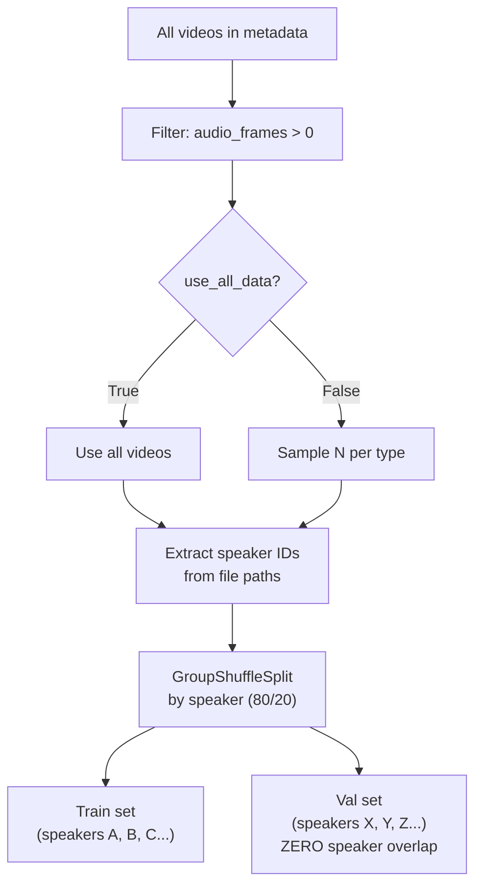
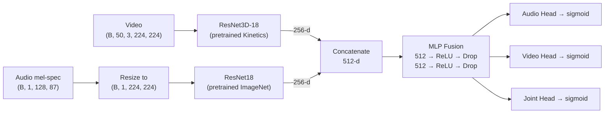

# AV-Deepfake Detection Pipeline — Complete Reference

## Overview

This pipeline detects deepfake videos using **both audio and video** modalities. It trains a model to answer three questions per video:
1. Is the **audio** real or fake?
2. Is the **video** real or fake?
3. Is the **whole thing** authentic? (joint prediction)

---

## File Map

| File | Role |
|---|---|
| [config.py](file:///Users/jasmi/Desktop/AV-Deepfake1M/Try/config.py) | All paths, hyperparameters, and feature settings |
| [data_utils.py](file:///Users/jasmi/Desktop/AV-Deepfake1M/Try/data_utils.py) | Metadata loading, speaker-based splitting, feature extraction, dataset class |
| [audio.py](file:///Users/jasmi/Desktop/AV-Deepfake1M/Try/audio.py) | Audio encoder (ResNet18 on mel-spectrograms) |
| [video.py](file:///Users/jasmi/Desktop/AV-Deepfake1M/Try/video.py) | Video encoder (ResNet3D-18 on frame sequences) |
| [cross_modal.py](file:///Users/jasmi/Desktop/AV-Deepfake1M/Try/cross_modal.py) | Fusion module (combines audio + video → predictions) |
| [train_utils.py](file:///Users/jasmi/Desktop/AV-Deepfake1M/Try/train_utils.py) | Training loop, validation, loss functions, optimizer setup |
| [checkpoint_utils.py](file:///Users/jasmi/Desktop/AV-Deepfake1M/Try/checkpoint_utils.py) | Save/load checkpoints for resumable training |
| [download_data.py](file:///Users/jasmi/Desktop/AV-Deepfake1M/Try/download_data.py) | Download val data from Hugging Face + extract zips |
| [main.py](file:///Users/jasmi/Desktop/AV-Deepfake1M/Try/main.py) | Entry point — ties everything together |

---

## Pipeline Flow (Step by Step)

### Step 1 — Load Metadata
```
main.py:344  →  data_utils.load_metadata()
```
Reads `val_metadata.json` from the validation directory. Each entry has:
- `file` — relative video path (e.g. `source/speaker_id/clip.mp4`)
- `modify_type` — `real`, `audio_modified`, `visual_modified`, or `both_modified`
- `audio_frames` / `video_frames` — frame counts
- `fake_segments` — `[[start_sec, end_sec], ...]` timestamps of manipulated regions

### Step 2 — Speaker-Based Sampling & Split
```
main.py:345  →  data_utils.sample_videos()
```



**Why speaker-based?** If the same person's videos appear in both train and val, the model can "cheat" by recognizing the person's face/voice instead of detecting manipulation. `GroupShuffleSplit` ensures every video from one speaker stays in the **same** split.

The output prints:
- How many speakers in train vs val
- Speaker overlap count (should always be **0**)
- Per-type video counts in each split

### Step 3 — Feature Extraction
```
main.py:352  →  data_utils.extract_all_features()  →  process_split()  →  extract_av_features()
```

For each video, a **2-second window** is extracted:

| | How it works | Output shape |
|---|---|---|
| **Window** | If fake: starts at first fake segment. If real: takes the middle 2 seconds | — |
| **Video** | Read 50 frames (2s × 25fps), resize to 224×224, normalize to [0,1] | `(50, 3, 224, 224)` |
| **Audio** | Load 2s at 16kHz, compute 128-bin mel-spectrogram in dB | `(1, 128, 87)` |

Features are **cached to pickle files** — if they exist, extraction is skipped on re-runs. Use `--fresh` flag to force re-extraction.

**Labels** per video type:

| Type | Audio label | Video label | Joint label |
|---|---|---|---|
| `real` | 1 (real) | 1 (real) | 1 (real) |
| `audio_modified` | 0 (fake) | 1 (real) | 0 (fake) |
| `visual_modified` | 1 (real) | 0 (fake) | 0 (fake) |
| `both_modified` | 0 (fake) | 0 (fake) | 0 (fake) |

### Step 4 — Model Architecture
```
main.py:375  →  AVDeepfakeDetector()
```



- All three heads output a value between 0 and 1 (0 = fake, 1 = real)
- Pretrained backbones provide strong initial features even with limited data

### Step 5 — Training
```
main.py:408  →  train_utils.train_model()
```

**Two-phase approach:**

| Phase | Epochs | What trains | Why |
|---|---|---|---|
| **Phase 1** (Frozen) | 1–8 | Only the fusion MLP | Prevents destroying pretrained features while the fusion layer learns to combine them |
| **Phase 2** (Fine-tune) | 9–50 | Everything (encoders at low LR) | Adapts pretrained features to deepfake-specific patterns |

**Loss function:**
```
Loss = BCE(audio_pred, audio_label)
     + BCE(video_pred, video_label)  
     + 2× BCE(joint_pred, joint_label)    ← weighted higher
```
- Training uses **label smoothing** (5%) to prevent overconfidence
- Validation uses standard BCE (no smoothing)
- Joint loss is weighted 2× because it's the primary detection target

**Other training details:**
- **Optimizer:** AdamW (fusion: lr=1e-4, encoders: lr=1e-5, weight_decay=1e-4)
- **Scheduler:** ReduceLROnPlateau — halves LR after 5 epochs of no val loss improvement
- **Gradient clipping:** max norm 1.0
- **Early stopping:** stops after 15 epochs with no AUC improvement
- **Checkpoints:** saved every epoch — training is fully resumable

### Step 6 — Evaluation
```
main.py:423  →  evaluate_model()
```

Loads the **best model** (by joint AUC) and produces:
1. **Scatter plot** — audio_pred vs video_pred, colored by type (should show 4 distinct clusters)
2. **Per-type accuracy** — bar chart for audio/video/joint
3. **Prediction distribution** — histogram of joint_pred on val set
4. **Confusion matrix** — 2×2 for joint fake/real classification
5. **AUC scores** — for audio, video, and joint predictions

---

## The Speaker-Based Split — Why It Matters

### Before (random split)
```
Train: [speaker_A_vid1, speaker_B_vid1, speaker_A_vid2, speaker_C_vid1]
Val:   [speaker_A_vid3, speaker_B_vid2]
                ↑ LEAK: speaker A is in both splits
```
The model could score high by recognizing faces/voices it saw during training, not by detecting manipulation.

### After (speaker-based split)
```
Train: [speaker_A_vid1, speaker_A_vid2, speaker_A_vid3, speaker_B_vid1]
Val:   [speaker_C_vid1, speaker_C_vid2, speaker_D_vid1]
                ✓ ZERO overlap: val speakers are completely new
```
The model **must** learn manipulation artifacts, because it has never seen these speakers before.

> [!IMPORTANT]
> The accuracy numbers with speaker-based split will likely be **lower** than with random split. This is expected — it means the random split was giving an **inflated** score. The speaker-based numbers are the honest ones.

---

## How to Run

```bash
# Full dataset, no W&B logging
python main.py --no_wandb

# 20-video test mode (set use_all_data: False in config.py first)
python main.py --no_wandb

# Start fresh (clear checkpoints and cached features)
python main.py --no_wandb --fresh

# Custom settings
python main.py --encoder_type pretrained --fusion_type attention --epochs 30
```

## Config Quick Reference

| Setting | Current Value | What it does |
|---|---|---|
| `use_all_data` | `True` | Use full val set (set `False` for 20-video test) |
| `batch_size` | `16` | Decrease to 4–8 if GPU runs out of memory |
| `epochs` | `50` | Max epochs (early stopping usually triggers sooner) |
| `patience` | `15` | Early stop after this many epochs with no AUC gain |
| `freeze_epochs` | `8` | Epochs with frozen encoders before fine-tuning |
| `val_split` | `0.2` | 80% train / 20% val |

---

## Changes: Disk-Based Lazy-Loading Optimization

### Problem
The original pipeline held **all video features in RAM** as a Python list before pickling to disk. Each video tensor is ~30MB, so 60K videos required ~1.8TB of RAM — causing Colab to crash at ~1,700 videos with 51GB usage.

### Solution — 3 Files Modified

#### `data_utils.py` (rewritten)
- **Individual `.pt` files**: Each video's features (video tensor, audio tensor, labels) are saved as a separate `.pt` file under `features/train/` and `features/val/`
- **Lazy-loading `AVDataset`**: The DataLoader loads one `.pt` file at a time per worker during training — RAM stays constant (~2-3GB) regardless of dataset size
- **Resumable extraction**: A `manifest.json` is saved every 500 videos. If extraction crashes, re-running skips already-extracted videos and picks up where it left off
- **Audio shape fixed**: Changed `n_fft` from 2048 to 1024 so mel-spectrogram output is a consistent `(1, 128, 63)` regardless of input audio length
- **PySoundFile warnings suppressed**: Wrapped `librosa.load()` with `warnings.catch_warnings()` to silence the fallback warning

#### `config.py`
- Replaced `FEATURES_TRAIN_PATH` / `FEATURES_VAL_PATH` (pickle files) with `FEATURES_DIR` (directory for `.pt` files)

#### `main.py`
- Updated imports and function calls to match new signatures
- `--fresh` flag now uses `shutil.rmtree()` to clear the entire features directory
- Added `import shutil`

### Feature Storage Structure
```
checkpoints/
  features/
    train/
      0.pt, 1.pt, 2.pt, ...    ← one per video (~30MB each)
    val/
      0.pt, 1.pt, ...
    train_manifest.json         ← metadata index (file, type, speaker)
    val_manifest.json
```

### How Resuming Works
1. On first run, `process_split_to_disk()` extracts features and writes `.pt` files + manifest
2. If the process crashes at video N, the manifest has entries 0 to N-1
3. On re-run (without `--fresh`), it loads the manifest and **skips** all already-extracted indices
4. Extraction continues from video N onward

---

## Changes: Replaced librosa with torchaudio

### Problem
`librosa` relied on PySoundFile/audioread for loading audio from video files, producing frequent `PySoundFile failed` warnings and occasional crashes on corrupted MP4 files.

### Solution — `data_utils.py`
- Replaced `librosa.load()` + `librosa.feature.melspectrogram()` with `torchaudio.load()` + `torchaudio.transforms.MelSpectrogram()`
- Audio pipeline is now fully PyTorch-native: load → resample → mono → slice → mel-spectrogram → AmplitudeToDB
- No more PySoundFile/audioread dependency chain
- `librosa` no longer needed as a dependency

---

## Changes: Failed File Tracking

### Problem
Corrupted MP4 files (e.g. `moov atom not found`) would fail extraction but not get a `.pt` file saved. On every restart, the pipeline would retry these files — wasting time.

### Solution — `data_utils.py`
- Added `{split_name}_failed.json` that records indices of files that failed extraction
- On resume, failed indices are loaded and **instantly skipped**
- Failed list is saved alongside the manifest every 500 videos for crash safety
- Both `video_tensor is None` and `file not found` failures are tracked

---

## Changes: User Input Prompt Before Extraction

### Problem
Google Drive storage can run out before all 77K features are extracted (~30MB per `.pt` file). Users need the ability to stop extraction early and train with whatever features are available.

### Solution — `main.py`
- After data loading, shows extraction progress:
  ```
  FEATURE EXTRACTION STATUS
    Train: 30,412 / 60,726 extracted
    Val:   8,200 / 16,389 extracted
  
  Continue extracting features? (y = extract more, n = skip to training with existing):
  ```
- **`y`** → continues extracting more features
- **`n`** → skips to training using only the already-extracted `.pt` files
- If all features are already extracted, skips the prompt entirely

---

## Changes: Hugging Face Data Download

### Problem
Setting up the pipeline on a new machine (VPS, fresh Colab) required manually downloading and extracting the 56GB val dataset.

### Solution — New file `download_data.py` + `main.py` integration

#### `download_data.py`
- Uses `huggingface_hub` API to download val zip parts and `val_metadata.json`
- Handles Hugging Face login (gated dataset requires accepted terms)
- Extracts multi-volume zips using 7z, unzip, or Python zipfile fallback
- **Resume support** — skips already-downloaded files
- Can be run standalone: `python download_data.py --data_dir /path/to/data`

#### `main.py`
- Auto-detects if `VAL_DIR` is missing or empty on startup
- Prompts: `Download val data from Hugging Face? (y/n)`
- If yes, runs the full download + extraction pipeline before proceeding
- If no, exits gracefully

### Prerequisites
```bash
pip install huggingface_hub
huggingface-cli login  # one-time, need to accept dataset terms first
apt-get install p7zip-full  # for multi-volume zip extraction
```
