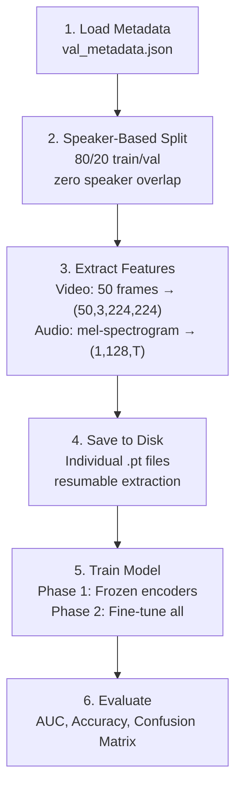
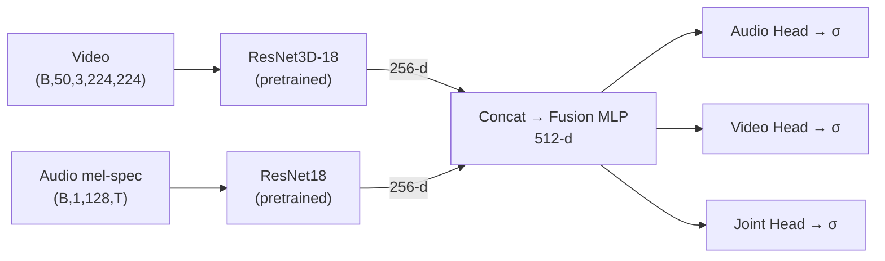

# Deepfake Detection (AV-Deepfake1M++)

Deepfake detection using audio-video cross-modal fusion with deep learning.

## Pipeline Flow



## Model Architecture



## File Structure

```
├── config.py           # Configuration settings
├── audio.py            # Audio encoder (ResNet18)
├── video.py            # Video encoder (ResNet3D-18)
├── cross_modal.py      # Cross-modal fusion models
├── data_utils.py       # Data loading, speaker split, feature extraction
├── train_utils.py      # Training loop, loss, optimizer
├── checkpoint_utils.py # Checkpoint management
└── main.py             # Main execution script
```

## Usage

```bash
# Full dataset run
python main.py

# Start fresh (clear old checkpoints/features)
python main.py --fresh

# Without W&B logging
python main.py --no_wandb

# Custom encoder/fusion
python main.py --encoder_type pretrained --fusion_type attention --epochs 30
```
