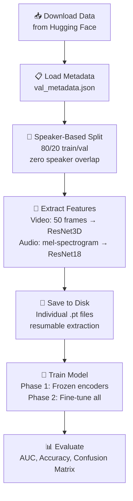
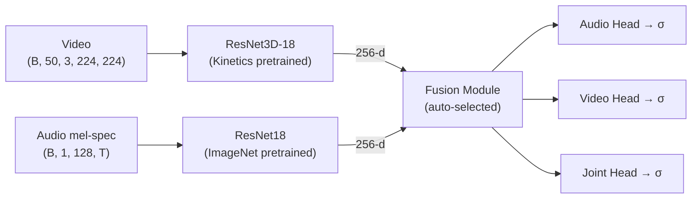

<h1 align="center">🎭 AV-Deepfake1M++ Detection</h1>

<p align="center">
  <strong>Audio-Video Deepfake Detection using Cross-Modal Transformer Fusion</strong>
</p>

<p align="center">
  <a href="https://huggingface.co/datasets/ControlNet/AV-Deepfake1M-PlusPlus">
    
  </a>
  
  
</p>

---

## Overview

A modular deepfake detection pipeline that analyzes **both audio and video** modalities to determine if a video has been manipulated. The system answers three questions per video:

| Prediction | Question |
|---|---|
| **Audio** | Is the audio track authentic? |
| **Video** | Are the visual frames authentic? |
| **Joint** | Is the overall video authentic? |

Built on the [AV-Deepfake1M++](https://huggingface.co/datasets/ControlNet/AV-Deepfake1M-PlusPlus) dataset with 77K+ validation videos across 4 manipulation types: `real`, `audio_modified`, `visual_modified`, and `both_modified`.

---

## Pipeline



---

## Model Architecture

The model uses **pretrained encoders** to extract features from each modality, then fuses them for classification:



### Fusion Modes

| Mode | Architecture | Best For |
|---|---|---|
| `auto` **(default)** | Transformer on GPU, MLP on CPU | Automatic |
| `transformer` | 2-layer Transformer Encoder + [CLS] token | GPU training |
| `pretrained` | 2-layer MLP with dropout | CPU / lightweight |
| `attention` | Cross-modal multi-head attention | Moderate compute |

---

## Quick Start

### 1. Clone & Install

```bash
git clone https://github.com/Jasmipreethi/Deepfake.git
cd Deepfake
pip install -r requirements.txt
apt-get install p7zip-full   # for zip extraction
```

### 2. Configure

Copy and edit the `.env` file with your API keys and paths:

```bash
# API Keys
HF_TOKEN=hf_xxxxxxxxxxxx
WANDB_API_KEY=xxxxxxxxxxxx

# Paths (uncomment for VPS)
DATA_DIR=/workspace/Deepfake/data
CHECKPOINT_DIR=/workspace/Deepfake/checkpoints
```

### 3. Run

```bash
# Full pipeline (download → extract → train → evaluate)
python main.py --fresh

# Resume training (skip already-extracted features)
python main.py

# Without W&B logging
python main.py --no_wandb

# Force a specific fusion type
python main.py --fusion_type transformer
```

The pipeline will auto-detect missing data and offer to download from Hugging Face.

---

## Training Details

| Setting | Value |
|---|---|
| **Two-Phase Training** | Phase 1: frozen encoders (8 epochs), Phase 2: fine-tune all |
| **Loss** | BCE with label smoothing (5%), joint loss weighted 2× |
| **Optimizer** | AdamW (fusion: 1e-4, encoders: 1e-5) |
| **Scheduler** | ReduceLROnPlateau (patience=5) |
| **Early Stopping** | 15 epochs without AUC improvement |
| **Speaker-Based Split** | Zero speaker overlap between train/val |

---

## Project Structure

```
├── config.py            # Paths and hyperparameters (reads from .env)
├── audio.py             # Audio encoder (ResNet18)
├── video.py             # Video encoder (ResNet3D-18)
├── cross_modal.py       # Fusion modules (MLP, Attention, Transformer)
├── data_utils.py        # Data loading, speaker split, feature extraction
├── train_utils.py       # Training loop, loss, optimizer
├── checkpoint_utils.py  # Checkpoint save/load for resumable training
├── download_data.py     # Download dataset from Hugging Face
├── main.py              # Entry point — orchestrates the full pipeline
├── requirements.txt     # Python dependencies
├── .env                 # API keys and configurable paths (git-ignored)
└── PipelineAnalysis.md  # Detailed technical documentation
```

---

## Hardware Requirements

| Component | Minimum | Recommended |
|---|---|---|
| **GPU VRAM** | 8 GB (batch_size=8) | 24 GB (batch_size=32) |
| **RAM** | 16 GB | 32 GB |
| **Disk** | 500 GB SSD | 1 TB SSD |

---

## Dataset

**[AV-Deepfake1M++](https://huggingface.co/datasets/ControlNet/AV-Deepfake1M-PlusPlus)** — a large-scale audio-visual deepfake dataset.

| Type | Audio | Video | Count |
|---|---|---|---|
| `real` | ✅ Real | ✅ Real | ~19K |
| `audio_modified` | ❌ Fake | ✅ Real | ~19K |
| `visual_modified` | ✅ Real | ❌ Fake | ~19K |
| `both_modified` | ❌ Fake | ❌ Fake | ~19K |

> **License:** CC BY-NC 4.0 — requires accepting terms on Hugging Face before download.

---

## Acknowledgments

- Dataset: [AV-Deepfake1M++](https://huggingface.co/datasets/ControlNet/AV-Deepfake1M-PlusPlus) by ControlNet
- Video encoder: [ResNet3D-18](https://pytorch.org/vision/stable/models.html) pretrained on Kinetics-400
- Audio encoder: [ResNet18](https://pytorch.org/vision/stable/models.html) pretrained on ImageNet
