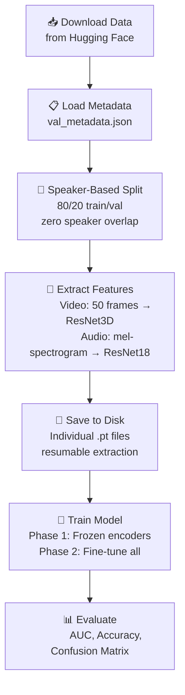
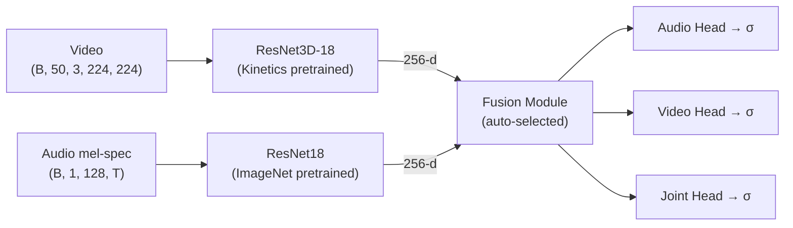

<h1 align="center">🎭 AV-Deepfake1M++ Detection</h1>

<p align="center">
  <strong>Audio-Video Deepfake Detection using Cross-Modal Transformer Fusion</strong>
</p>

<p align="center">
  <a href="https://huggingface.co/datasets/ControlNet/AV-Deepfake1M-PlusPlus">
    
  </a>
  
  
</p>

---

## Empirical Evaluation of Multimodal Deception Capabilities

**Abstract**
As generative models advance, evaluating their capacity for multimodal deception becomes critical for AI security. Traditional media forensics fail to capture the cross-modal inconsistencies inherent in modern agentic deception. This project presents an empirical evaluation framework designed to benchmark how effectively synthetic models maintain cross-modal coherence (audio-visual synchronisation) when deceiving human overseers.

We engineered a Cross-Modal Transformer Fusion architecture—integrating ResNet3D-18 and ResNet18 encoders with a two-layer multi-head attention fusion module. To prevent identity leakage and enforce strict out-of-distribution evaluation, the system was trained under a speaker-disjoint partition using Focal Loss.

**Key Findings:**

* **Modality-Specific Dissociation:** The three-head multi-task architecture successfully isolated deception vectors. The system correctly suppressed audio authenticity scores for `audio_modified` clips whilst maintaining high video authenticity scores, proving the capacity to independently verify modality coherence.

* **Calibration Over Convergence:** Empirical results demonstrated that extended fine-tuning degrades score calibration. Our early-stopped checkpoint (Model 3) achieved 93.0% accuracy on the test set with zero false positives, significantly outperforming the fully converged model.

This repository contains the complete, reproducible training pipeline, web-based inference evaluation tool, and the raw experimental logs demonstrating our results.

**Full dissertation:** [`Deepfake_detection_using_cross-model_transformer_fusion.pdf`](./Deepfake_detection_using_cross-model_transformer_fusion.pdf)

---

## Pipeline


```mermaid
flowchart TD
    A["📥 Download Data
      from Hugging Face"] --> B["📋 Load Metadata\nval_metadata.json"]
    B --> C["👥 Speaker-Based Split
            80/20 train/val
            zero speaker overlap"]
    C --> D["🔧 Extract Features
            Video: 50 frames → ResNet3D
            Audio: mel-spectrogram → ResNet18"]
    D --> E["💾 Save to Disk
            Individual .pt files
            resumable extraction"]
    E --> F["🧠 Train Model
            Phase 1: Frozen encoders
            Phase 2: Fine-tune all"]
    F --> G["📊 Evaluate
            AUC, Accuracy, Confusion Matrix"]
```

---

## Model Architecture

The model uses **pretrained encoders** to extract features from each modality, then fuses them for classification:


```mermaid
flowchart LR
    V["Video\n(B, 50, 3, 224, 224)"] --> VE["ResNet3D-18\n(Kinetics pretrained)"]
    A["Audio mel-spec\n(B, 1, 128, T)"] --> AE["ResNet18\n(ImageNet pretrained)"]
    VE --> |"256-d"| FUS
    AE --> |"256-d"| FUS
    FUS["Fusion Module\n(auto-selected)"] --> AH["Audio Head → σ"]
    FUS --> VH["Video Head → σ"]
    FUS --> JH["Joint Head → σ"]
```

### Fusion Modes

| Mode | Architecture | Best For |
|---|---|---|
| `auto` **(default)** | Transformer on GPU, MLP on CPU | Automatic |
| `transformer` | 2-layer Transformer Encoder + [CLS] token | GPU training |
| `pretrained` | 2-layer MLP with dropout | CPU / lightweight |
| `attention` | Cross-modal multi-head attention | Moderate compute |

---

## Quick Start

### 1. Clone & Install

```bash
git clone https://github.com/Jasmipreethi/Deepfake.git
cd Deepfake
pip install -r requirements.txt
apt-get install p7zip-full   # for zip extraction
```

### 2. Configure

Copy and edit the `.env` file with your API keys and paths:

```bash
# API Keys
HF_TOKEN=hf_xxxxxxxxxxxx
WANDB_API_KEY=xxxxxxxxxxxx

# Paths (uncomment for VPS)
DATA_DIR=/workspace/Deepfake/data
CHECKPOINT_DIR=/workspace/Deepfake/checkpoints
```

### 3. Run

```bash
# Full pipeline (download → extract → train → evaluate)
python main.py --fresh

# Resume training (skip already-extracted features)
python main.py

# Without W&B logging
python main.py --no_wandb

# Force a specific fusion type
python main.py --fusion_type transformer

# Analyze dataset before training
python analyze_data.py

# Compare multiple models
python compare_models.py \
    --models logs/logs_1/best_model.pth logs/logs_2/best_model.pth \
    --names "Model 1" "Model 2" \
    --video_dir ./test/ \
    --output_dir comparison_results/

# Run web interface
python web/app.py
```

### 4. Web Interface
Open **http://localhost:5000** to access the browser-based tool.
- **Analyze** — drag-and-drop upload, model selector, real-time verdict + audio/video/joint scores
- **Compare** — run one video through both models side-by-side with agree/disagree summary
- **History** — SQLite-backed table of all past analyses with per-entry delete and bulk clear

---

### 5. Generate Dissertation Figures

```bash
# Training history — loss/AUC curves from per-epoch metrics
python plot_training_history.py

# Per-type accuracy bar chart — from model prediction CSVs
python plot_per_type_accuracy.py

# Mel-spectrogram comparison — real vs fake audio side-by-side
python plot_mel_spectrogram.py
```

All outputs go to `figures/`. Requires `matplotlib`, `torch`, `torchaudio`. `plot_mel_spectrogram.py` also needs `ffmpeg`.

---

## Training Details

| Setting | Value |
|---|---|
| **Two-Phase Training** | Phase 1: frozen encoders (2 epochs), Phase 2: fine-tune all (LR 10× lower) |
| **Loss** | Focal Loss (γ=2.0, α=0.25), joint head weighted 2× |
| **Optimizer** | AdamW (fusion: 1e-4, encoders: 1e-5) |
| **Scheduler** | ReduceLROnPlateau (patience=5, factor=0.5) |
| **Early Stopping** | 30% of total epoch budget without AUC improvement |
| **Speaker-Based Split** | Zero speaker overlap between train/val |

---

## Project Structure

```
├── config.py            # Paths and hyperparameters (reads from .env)
├── audio.py             # Audio encoder (ResNet18)
├── video.py             # Video encoder (ResNet3D-18)
├── cross_modal.py       # Fusion modules (MLP, Attention, Transformer)
├── data_utils.py        # Data loading, speaker split, feature extraction
├── train_utils.py       # Training loop, loss, optimizer
├── checkpoint_utils.py  # Checkpoint save/load for resumable training
├── download_data.py     # Download dataset from Hugging Face
├── analyze_data.py      # Dataset analysis and visualization
├── create_test_data.py  # Generate leak-free test sets (val speakers only)
├── compare_models.py    # Multi-model comparison with full metrics/plots
├── evaluate_models.py   # [DEPRECATED] superseded by compare_models.py
├── inference.py         # Standalone single-video inference
├── plot_training_history.py   # Generate training curves from output.txt
├── plot_per_type_accuracy.py  # Generate per-type accuracy bar chart
├── plot_mel_spectrogram.py    # Generate real vs fake mel-spectrogram comparison
├── main.py              # Entry point — orchestrates the full pipeline
├── requirements.txt     # Python dependencies
├── .env                 # API keys and configurable paths (git-ignored)
├── Walkthrough.md       # Detailed code walkthrough
├── WebInterface.md      # Web API specification
├── PipelineAnalysis.md  # Pipeline technical documentation
├── comparison_results/  # Model comparison outputs (CSVs, plots, metrics)
├── figures/             # Generated figures for dissertation
│   ├── training_history_model4.png
│   ├── per_type_accuracy_bar_chart.png
│   └── mel_spectrogram_comparison.png
├── logs/                # Training checkpoints and run logs
└── web/                 # Web interface
    ├── app.py           # Flask server (wraps inference.py)
    ├── templates/index.html
    └── static/          # CSS + JS
```

---

## Hardware Requirements

| Component | Minimum | Recommended |
|---|---|---|
| **GPU VRAM** | 8 GB (batch_size=8) | 24 GB (batch_size=32) |
| **RAM** | 16 GB | 32 GB |
| **Disk** | 500 GB SSD | 1 TB SSD |

---

## Dataset

**[AV-Deepfake1M++](https://huggingface.co/datasets/ControlNet/AV-Deepfake1M-PlusPlus)** — a large-scale audio-visual deepfake dataset.

| Type | Audio | Video | Count |
|---|---|---|---|
| `real` | ✅ Real | ✅ Real | ~19K |
| `audio_modified` | ❌ Fake | ✅ Real | ~19K |
| `visual_modified` | ✅ Real | ❌ Fake | ~19K |
| `both_modified` | ❌ Fake | ❌ Fake | ~19K |

> **License:** CC BY-NC 4.0 — requires accepting terms on Hugging Face before download.

---

## Acknowledgments

- Dataset: [AV-Deepfake1M++](https://huggingface.co/datasets/ControlNet/AV-Deepfake1M-PlusPlus) by ControlNet
- Video encoder: [ResNet3D-18](https://pytorch.org/vision/stable/models.html) pretrained on Kinetics-400
- Audio encoder: [ResNet18](https://pytorch.org/vision/stable/models.html) pretrained on ImageNet
