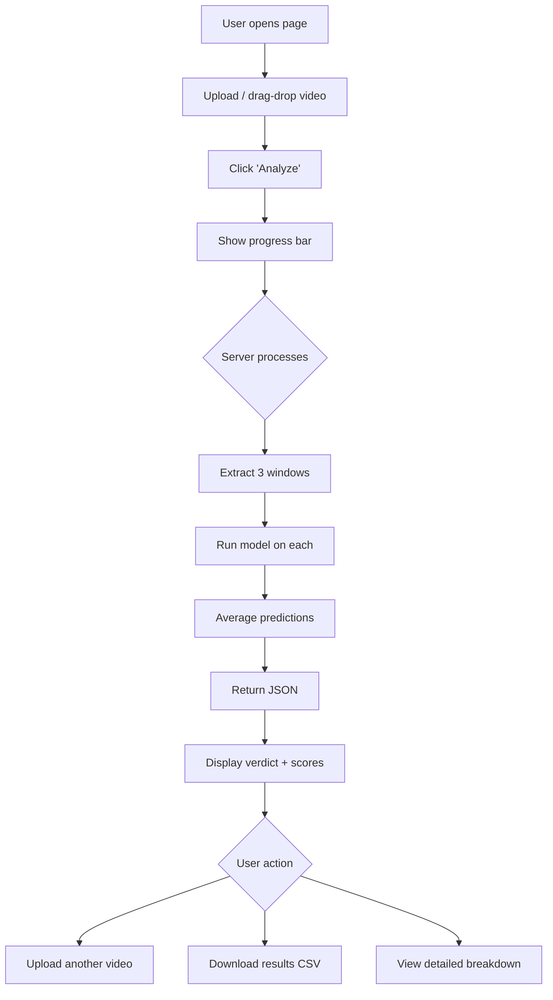

# Web Interface — AV Deepfake Detector

A browser-based tool that lets users upload a video and get a real-time deepfake analysis.

---

## Overview

```
User uploads video → Server extracts features → Model predicts → Results displayed
```

The interface wraps `inference.py` in a web app. No ML knowledge required to use it.

---

## Pages

### 1. Upload Page (Home)

**Layout:** Centered card on a dark gradient background.

| Element | Description |
|---|---|
| **Title** | "AV Deepfake Detector" with subtitle "Upload a video to check if it's real or fake" |
| **Upload area** | Drag-and-drop zone with file picker button. Accepts `.mp4`, `.avi`, `.mov`, `.mkv`, `.webm` |
| **File info** | Shows filename, size, and duration after selection |
| **Analyze button** | Large primary button — "Analyze Video" |
| **Progress bar** | Appears during processing with stages: "Extracting features..." → "Running model..." → "Done" |
| **Model selector** | Dropdown to pick which `.pth` model to use (if multiple available) |

### 2. Results Page

**Layout:** Two-column layout — video preview on left, results on right.

#### Left Column — Video Preview
- Embedded video player with playback controls
- Clickable timeline showing which 2-second window was analyzed (highlighted region)

#### Right Column — Verdict & Scores

| Section | Content |
|---|---|
| **Verdict badge** | Large "REAL" (green) or "FAKE" (red) badge with confidence percentage |
| **Confidence meter** | Horizontal gauge from 0-100% showing how certain the model is |
| **Score breakdown** | Three progress bars: Audio score, Video score, Joint score (0.0 to 1.0 each) |
| **Interpretation** | Plain-English explanation: "The audio appears manipulated (score: 0.12) while the video appears authentic (score: 0.89). The overall assessment is FAKE." |

#### Score Visualization
```
Audio:  ████████░░░░░░░░░░░░  0.12  ← FAKE
Video:  █████████████████░░░  0.89  ← REAL  
Joint:  ██████░░░░░░░░░░░░░░  0.31  ← FAKE (overall verdict)
```

#### Detailed Analysis (collapsible)
- Number of windows analyzed (default: 3)
- Per-window scores table
- Processing time

### 3. History Page (optional)

- Table of previously analyzed videos with verdict, scores, and timestamp
- Re-analyze or download results as CSV
- Clear history button

---

## Tech Stack

| Layer | Technology | Why |
|---|---|---|
| **Frontend** | HTML + CSS + JavaScript | Simple, no build step needed |
| **Backend** | Flask or FastAPI | Lightweight Python server, shares code with `inference.py` |
| **Model serving** | PyTorch (CPU or GPU) | Same weights as training |
| **File handling** | Temp directory | Uploaded videos deleted after analysis |

---

## API Endpoints

### `POST /api/analyze`
Upload a video for analysis.

**Request:** `multipart/form-data` with video file  
**Response:**
```json
{
  "verdict": "FAKE",
  "confidence": 0.87,
  "scores": {
    "audio": 0.12,
    "video": 0.89,
    "joint": 0.31
  },
  "windows_analyzed": 3,
  "processing_time_sec": 4.2,
  "per_window": [
    {"audio": 0.11, "video": 0.88, "joint": 0.30},
    {"audio": 0.13, "video": 0.91, "joint": 0.32},
    {"audio": 0.12, "video": 0.87, "joint": 0.31}
  ]
}
```

### `GET /api/models`
List available model files.

**Response:**
```json
{
  "models": [
    {"name": "best_model_run1.pth", "fusion": "transformer", "epoch": 20, "auc": 0.94},
    {"name": "best_model_run2.pth", "fusion": "transformer", "epoch": 35, "auc": 0.96}
  ],
  "active": "best_model_run2.pth"
}
```

### `GET /api/health`
Health check — confirms model is loaded and ready.

---

## UI Flow



---

## Design Guidelines

| Aspect | Guideline |
|---|---|
| **Color scheme** | Dark background (#1a1a2e), green for REAL (#2ecc71), red for FAKE (#e74c3c) |
| **Typography** | Inter or Roboto, large verdict text (48px), scores in monospace |
| **Animations** | Smooth progress bar, verdict badge fade-in with slight scale animation |
| **Responsive** | Works on mobile — single column layout on small screens |
| **Max file size** | 500MB (configurable via server) |
| **Timeout** | 60 seconds per video (configurable) |

---

## File Structure

```
web/
├── app.py              # Flask/FastAPI server
├── templates/
│   └── index.html      # Single-page app
├── static/
│   ├── style.css       # Styles
│   └── app.js          # Upload handling, results display
└── models/             # Symlink or copy of .pth files
```

---

## Deployment Options

| Option | Pros | Cons |
|---|---|---|
| **Local** (`python app.py`) | Simple, GPU access | Not shareable |
| **Docker** | Portable, reproducible | Larger image (~5GB with PyTorch) |
| **Hugging Face Spaces** | Free hosting, GPU available | File size limits, cold starts |
| **Cloud VM** (same as training) | Full control, GPU | Costs money |

---

## Security Considerations

- Validate file type server-side (check magic bytes, not just extension)
- Limit upload size (default 500MB)
- Delete uploaded files after processing
- Rate limiting (prevent abuse)
- No user data stored permanently
