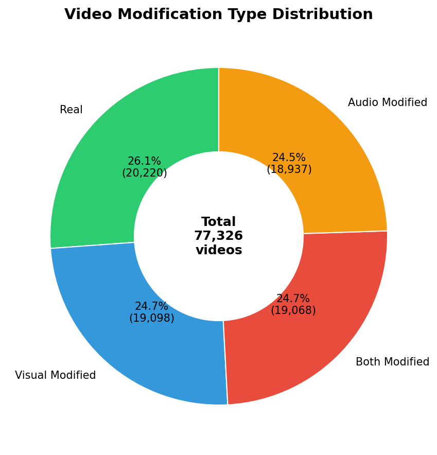
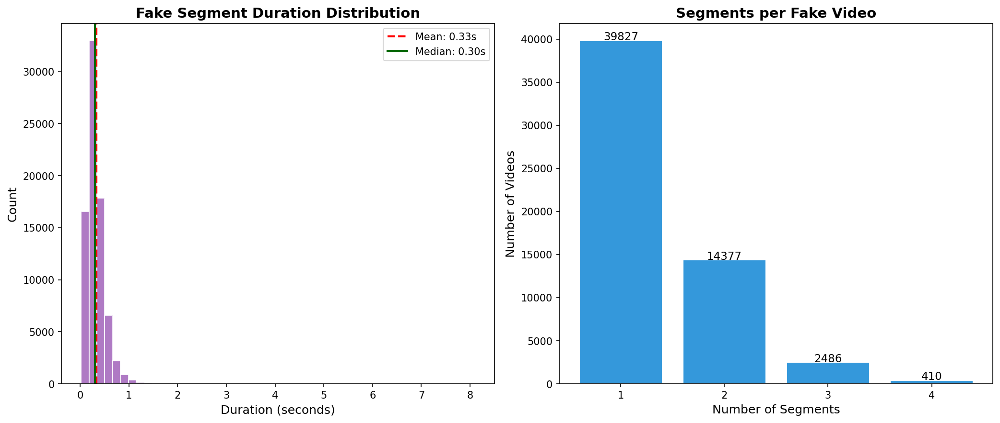
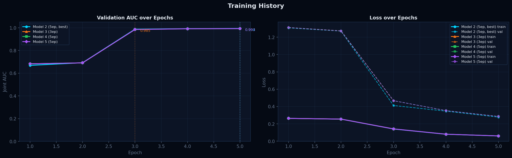
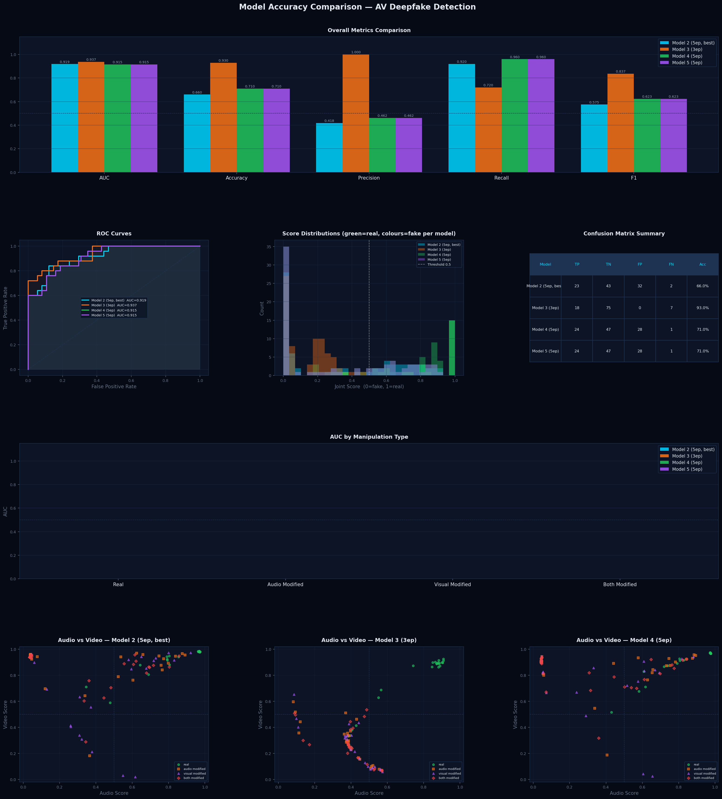

# Multimodal Audio-Visual Deepfake Detection Using Cross-Modal Transformer Fusion

---

# Abstract

Deepfake technology has advanced rapidly from early face-swapping systems to sophisticated multimodal generators capable of simultaneously manipulating both audio and video streams. This progress has created a growing demand for detection systems that go beyond single-modality analysis and jointly reason over audio and visual evidence. This dissertation presents the design, implementation, and evaluation of a multimodal deepfake detection pipeline trained on the AV-Deepfake1M++ dataset — a large-scale benchmark comprising over 77,000 video clips across four manipulation categories: real, audio-modified, visual-modified, and both-modified.

The implemented system is a Cross-Modal Transformer Fusion network that combines a ResNet3D-18 video encoder pretrained on Kinetics-400 with a ResNet18 audio encoder pretrained on ImageNet, fused through a two-layer Transformer Encoder with a learnable [CLS] token. The model produces three simultaneous predictions per clip — audio authenticity, video authenticity, and a joint verdict — trained using Focal Loss to address gradient domination by easy examples. A speaker-disjoint dataset partition was enforced to prevent identity leakage between training and validation sets, ensuring that reported performance reflects genuine generalisation to unseen identities.

The system achieved a peak validation joint AUC of 0.994 by epoch five (Model 2). However, evaluation on a speaker-disjoint test set of 100 videos revealed that Model 3 (trained for three epochs) exhibited superior practical performance, achieving 93% accuracy and 1.000 precision at a 0.5 decision threshold, with zero false positives. In contrast, Model 2 achieved 66% accuracy at the same threshold due to less optimal score calibration. These results demonstrate that while cross-modal attention is highly effective at capturing audio-visual inconsistencies, training duration significantly impacts the calibration of prediction scores. The architecture deviates from the initial proposal — which specified Wav2Vec 2.0, MobileNetV3, and DiMoDif — due to hardware constraints, audio loading instability, and the broader spatial distribution of visual artefacts across the full face rather than the lip region alone. Each deviation is documented and justified.

The dissertation contributes a fully modular, resumable training pipeline, a standalone inference system, and a web-based interface for video upload and classification. Limitations include the use of the validation split only, a fixed two-second analysis window, and a test set of 100 videos whose small size constrains the statistical robustness of the reported metrics.

---

# Chapter 1: Introduction

## 1.1 Background

The proliferation of deepfake technology poses an increasingly serious threat to the integrity of digital media. Advances in deep generative modelling — particularly Generative Adversarial Networks, diffusion models, and neural radiance fields — have enabled the synthesis of highly realistic audio and video content that is difficult to distinguish from authentic recordings. Deepfakes have been deployed in financial fraud, political misinformation, non-consensual pornography, and impersonation attacks, with documented real-world harms that extend well beyond academic research settings (Chesney and Citron, 2019; Milmo, 2024). The evolution of these techniques and their real-world impacts are reviewed in Sections 2.2 and 2.3.

Early deepfake detection systems focused on identifying spatial artefacts in individual frames — boundary inconsistencies, abnormal blinking, or unnatural skin texture — using convolutional neural networks trained on benchmark datasets such as FaceForensics++ (Rossler et al., 2019). These approaches achieved high accuracy within controlled settings but showed substantial performance degradation when applied to unseen generators or real-world media, suggesting that many detectors learned dataset-specific patterns rather than genuine manipulation signatures (Dolhansky et al., 2020). Detection methodologies and their generalisation limitations are reviewed in Section 2.6.

More recent deepfake systems manipulate both the audio and video streams simultaneously, introducing audio-visual mismatches — between speech content and lip motion, or between voice identity and facial appearance — that single-modality detectors are structurally unable to detect. This has driven increasing interest in multimodal detection approaches that jointly analyse both streams (Cai et al., 2024; Yi et al., 2023). Multimodal detection methods are reviewed in Section 2.6.4, and the gaps that remain are identified in Section 2.7.

## 1.2 Problem Statement

Despite growing interest in multimodal deepfake detection, several limitations persist in existing approaches. Most systems rely on simple feature concatenation rather than learned cross-modal attention, limiting their ability to capture subtle interdependencies between audio and visual evidence. Many remain vision-centric, treating audio as a secondary modality whose independent contribution is rarely quantified. Evaluation protocols frequently use random train/validation splits that allow speaker identity leakage, producing inflated performance figures that do not generalise to unseen individuals. These gaps are examined in detail in Section 2.7, and collectively motivate a system that applies cross-modal attention fusion, treats both modalities as equal contributors, enforces a speaker-disjoint evaluation protocol, and explicitly quantifies per-modality detection performance.

## 1.3 Aim

The aim of this project is to design, implement, and evaluate a multimodal audio-visual deepfake detection system that jointly analyses audio and video streams using cross-modal attention (Section 3.3.1), and to assess its performance across four manipulation types on the AV-Deepfake1M++ dataset (Section 3.3.2).

## 1.4 Objectives

1. To implement a speaker-disjoint dataset partitioning strategy that prevents identity leakage between training and evaluation sets. *(Section 3.3.2; evaluated in Section 5.2)*

2. To design and train a Cross-Modal Transformer Fusion network that jointly encodes audio mel-spectrograms and video frame sequences, producing independent audio, video, and joint authenticity predictions. *(Sections 3.3.3–3.3.5; evaluated in Section 5.2)*

3. To replace standard Binary Cross-Entropy with Focal Loss to improve convergence on hard, ambiguous examples during training. *(Section 3.4.1; evaluated in Section 5.2)*

4. To build a fully resumable training pipeline that supports cloud-based GPU instances with checkpoint recovery and Weights & Biases experiment tracking. *(Section 3.4.4; evaluated in Section 5.2)*

5. To evaluate the trained model on a representative 100-video test set and report AUC, accuracy, precision, recall, F1, and per-type performance breakdown. *(Chapter 4; discussed in Section 5.5)*

6. To develop a standalone inference system and web-based interface for classifying new videos outside the training pipeline. *(Section 3.7; evaluated in Section 5.2)*

## 1.5 Significance

This work contributes a complete end-to-end multimodal deepfake detection system built on one of the largest audio-visual deepfake datasets currently available (Section 3.3.2). The system is designed with research reproducibility in mind — all hyperparameters are centralised, all randomness is seeded, and the full training state is checkpointed (Section 3.4.4) — making it straightforward to extend or replicate. The three-head output design (Section 3.3.1) provides richer diagnostic information than a single binary classifier, allowing the contribution of each modality to be assessed independently.

## 1.6 Structure of the Dissertation

Chapter 2 reviews deepfake generation and detection techniques across image, audio, video, and multimodal domains, identifying the gaps that motivate this work. Chapter 3 describes the methodology and implementation, including documented deviations from the initially proposed architecture. Chapter 4 presents the results of training and evaluation. Chapter 5 discusses the findings in relation to the objectives, prior work, and limitations. Chapter 6 concludes with reflections and suggestions for future work.

---

# Chapter 2: Literature Review

## 2.1 Introduction

Recent advances in artificial intelligence have reshaped digital media forensics, largely due to the rapid rise of deepfakes. These synthetic videos and images, generated through deep neural architectures, can imitate human appearance and behaviour with increasing precision (He, 2021; Rossler et al., 2019). Although early work treated manipulated media as a relatively contained technical issue, current developments have made detection more difficult. As He (2021) pointed out, the realism achieved by modern generative models disrupts long-standing assumptions about what constitutes trustworthy audio-visual evidence. Rossler et al. (2019) further highlight that detection systems often are behind the pace of generative model improvements, creating a persistent asymmetry between manipulation and forensics. Given this trajectory, a clearer understanding of the underlying deep learning methods is necessary before evaluating why current detection strategies struggle and where they fall short.

### 2.1.1 Defining Deep Learning

Deep learning is defined as a subset of machine learning characterised by the utilisation of multi-layered neural networks. This architectural paradigm draws inspiration from the biological neural networks of the human brain, aiming to model high-level abstractions in data through a deep graph with multiple processing layers (LeCun, 2015). According to Goodfellow et al. (2016), deep learning systems differentiate themselves from conventional machine learning by their ability to learn representations of data with multiple levels of abstraction. While a shallow network might only have one hidden layer, a "deep" architecture utilises a hierarchy of layers to process data through a series of nested non-linear equations. This structure allows the model to function as a universal approximator, capable of modelling complex high-dimensional data patterns that simpler algorithms cannot capture (Hornik, 1989). The system developed in this dissertation is a deep learning pipeline spanning over thirty combined layers across three distinct neural architectures; Section 3.3.1 provides a full account of how each component satisfies the defining criteria of deep learning.

### 2.1.2 Defining Deepfake

The term deepfake combines "deep learning" and "fake," which describes synthetic media generated through deep neural models rather than conventional editing techniques (Westerlund, 2019). Most early systems relied on autoencoders or Generative Adversarial Networks, which made it possible to automate face swapping and expression transfer in a way that traditional manipulation tools could not achieve (Gera, 2018). Although digital alterations long predate deep learning, the specific phenomenon of deepfakes entered mainstream attention in late 2017 when a Reddit user released code that enabled realistic face swaps with very little technical skill, initially leading to widespread non-consensual pornography and, later, to wider use in misinformation and entertainment (Chesney and Cytowic, 2019; Westerlund, 2019). In research contexts, deepfakes are generally defined by their use of deep generative models to produce content that is difficult to distinguish from authentic footage (Cai, 2024). Over time, beyond face swaps, current systems include audio-based voice cloning and multimodal models capable of synchronising generated speech with fabricated lip movements, which introduces additional complexity for forensic detection (Yi et al., 2023). Together, these developments show that deepfakes are not a single technique but a growing family of generative methods with expanding forensic implications.

## 2.2 Evolution of Deepfakes

### 2.2.1 Phase 1: Visual Fidelity and Generative Advances

The initial phase of deepfake development focused on face swapping, using simple autoencoders and early Generative Adversarial Networks (GANs) (Dolhansky et al., 2020). These techniques were prone to noticeable flaws, such as affine warping errors, making them easily detectable by early forensic tools (Li et al., 2018). However, the field progressed rapidly with the adoption of improved training strategies such as the Two-Time Scale Update Rule (TTUR), which greatly improved GAN stability and convergence, resulting in more lifelike image generation (Heusel et al., 2017). As generative methods evolved, benchmark datasets such as the Deepfake Detection Challenge (DFDC) (Dolhansky et al., 2020) and Celeb-DF (Li et al., 2019) emerged. These resources marked a transition from low-grade and easily spotted fakes to high-quality videos that accurately replicated real-world visuals, posing significant challenges for detection systems (Li et al., 2019).

### 2.2.2 Phase 2: "In-the-Wild" Adaptation and Multi-Subject Expansion

A major advancement in deepfake technology was transitioning from controlled laboratory settings to more unpredictable "in-the-wild" environments. Although earlier datasets typically included individual subjects under uniform lighting and framing, newer deepfake datasets like Wild Deepfake (Zi et al., 2021) and FFIW-10K (Zhou et al., 2021) consist of content sourced from the internet or specifically generated to endure real-world challenges such as compression and noise. During this stage, deepfake methods were also advanced, enabling the manipulation of multiple people within the same scene. For example, research by Narayan et al. (2023) using the DF-Platter dataset showed that current techniques can alter multiple faces in a single image, even in challenging scenarios such as occlusion or poor image quality. Similarly, the FFIW-10K dataset highlighted the ongoing difficulty that forensic systems face in detecting fakes in group videos — especially when only some faces have been manipulated (Zhou et al., 2021).

### 2.2.3 Phase 3: Multimodal and Neural Generation

The latest and arguably most concerning development in deepfake technology is the move from only visual edits to multimodal deepfakes that manipulate both audio and video. Recent studies highlight the importance of inconsistencies between sound and visuals, leading to the creation of datasets such as AV-Deepfake1M (Cai, 2024) and FakeAVCeleb (Yi et al., 2023), which feature coordinated alterations to both video and audio streams. This evolution requires that detection tools now evaluate the synchronisation of lip movements with speech, rather than just looking for visual inconsistencies (Yi et al., 2023). In addition, the generative techniques themselves have progressed beyond traditional GANs. Neural Radiance Fields (NeRF) have been used to create talking-head videos where both viewpoint and audio can be modified (Guo et al., 2021). For audio, generation has advanced from simple concatenation methods to diffusion models, such as NaturalSpeech 2, which enable zero-shot voice synthesis with remarkably accurate intonation and prosody (Shen et al., 2023).

## 2.3 Documented Real-World Impacts and High-Profile Cases

Although early research on deepfakes largely focused on improving synthesis quality and benchmarking detection accuracy, larger concern has been driven by their increasing use in real-world scenarios (Chesney and Cytowic, 2019; Dolhansky et al., 2020; Rossler et al., 2019).

One area of significant impact has been medical misinformation. Investigative reporting has documented numerous cases in which deepfake videos impersonating qualified doctors were used to promote false health advice and fraudulent treatments across social media platforms (ITV News, 2024; Clark, 2025). These videos often exploit the visual credibility of trusted medical professionals, making misinformation difficult for non-expert audiences to identify. Such cases highlight how deepfakes can undermine public trust in expert knowledge, particularly in domains where inaccurate information may cause physical harm (Chesney and Cytowic, 2019; Rossler et al., 2019).

Deepfakes have also been employed in financial fraud and impersonation scams. A notable case involved a multinational engineering firm in which employees were deceived into authorising a large financial transfer after participating in a video call that appeared to feature senior executives but was later confirmed to be AI-generated (Milmo, 2024). Similar incidents have been reported globally, prompting warnings from law-enforcement agencies about the growing use of synthetic audio and video in social engineering attacks (Bragg, 2025). These cases demonstrate how deepfakes can amplify traditional fraud techniques by adding a convincing visual and auditory layer.

In addition to visual manipulation, audio deepfakes have demonstrated significant real-world impact, particularly in the context of fraud and impersonation (Korshunov and Marcel, 2018; Yi et al., 2023; Zhang, 2025). One of the first high-profile cases occurred in 2019, when attackers used a synthetic voice to mimic a company executive to authorise a fraudulent financial transfer, resulting in substantial financial losses (Stupp, 2019). Unlike visual deepfakes, audio-based impersonation can be deployed in real-time through phone calls or voice messages, limiting opportunities for human verification and increasing its effectiveness in social engineering scenarios (Korshunov and Marcel, 2018). Prior research demonstrates that synthetic speech can convincingly replicate speaker identity, enabling attacks that bypass traditional speaker verification and authentication systems (Korshunov and Marcel, 2018; Yi et al., 2023). Taken together, these findings indicate that audio deepfakes pose a parallel threat to trust and identity assurance mechanisms, reinforcing the need for detection approaches that extend beyond visual analysis and address multimodal manipulation (Rossler et al., 2019; Cai, 2024).

Political manipulation represents another area of concern associated with deepfakes, particularly in the context of increased geopolitical tension (Chesney and Cytowic, 2019; Vaccari, 2020). Videos depicting public figures have circulated online, sometimes appearing to show officials making false statements or announcements, thereby creating confusion regarding the authenticity of political communication (Rossler et al., 2019). An example involves a manipulated video of a national leader that was briefly disseminated on social media before being removed by platform moderators (Allyn, 2022). Although such videos do not always achieve their intended persuasive impact, studies suggest that their rapid circulation can take advantage of periods of uncertainty and contribute to decline of confidence in authentic news sources (Vaccari, 2020).

In addition to large-scale misinformation, deepfakes have caused direct personal harm. Investigations of non-consensual synthetic pornography have revealed extensive platforms dedicated to generating explicit content using the likenesses of individuals without consent, disproportionately targeting women (Moore, 2025). These cases underscore the ethical and legal challenges posed by deepfakes, particularly in situations where existing regulatory and legal frameworks struggle to address harms arising from fabricated yet highly realistic media (Chesney and Cytowic, 2019; Westerlund, 2019).

Taken together, these examples illustrate that deepfakes are no longer a purely technical problem confined to academic datasets. Their real-world deployment exposes weaknesses in current detection systems and reinforces the need for reliable, generalisable forensic approaches capable of operating under the unpredictable conditions of online media ecosystems (Rossler et al., 2019; Dolhansky et al., 2020).

## 2.4 The Dual Dilemma: Creative Application Versus Malicious Threat

Deepfake technologies exemplify a dual-use dilemma, in which the same deep generative models that enable legitimate and creative applications can also be exploited for harmful purposes. Advances in audio and visual synthesis have supported a range of beneficial use cases, including film post-production, automated dubbing, digital de-ageing, and assistive technologies such as personalised text-to-speech systems and voice restoration tools. In these contexts, synthetic media techniques are typically deployed with consent and transparency, and their use is framed as an extension of existing digital production methods (Westerlund, 2019; Yi et al., 2023). However, the properties that make deepfake technologies attractive for creative and commercial applications, namely high realism, automation, and scalability, also enable malicious misuse. As discussed in Section 2.3, deepfakes have been employed in misinformation campaigns, fraud, impersonation, and non-consensual content generation. The ability to fine-tune generative models using limited data further reduces the barrier to entry for misuse, allowing individuals without advanced technical expertise to produce convincing synthetic media (Chesney and Cytowic, 2019). This tension complicates regulatory and technical responses to deepfakes, as restrictive controls on generative technologies risk constraining legitimate innovation, while inadequate oversight allows harmful applications to proliferate (Chesney and Cytowic, 2019; Westerlund, 2019).

From a forensic perspective, this dual-use nature highlights the limitations of prevention-only strategies and reinforces the need for effective detection mechanisms (Chesney and Cytowic, 2019). Detection systems must therefore be capable of operating independently of the intent behind content creation, instead focusing on identifying artefacts, inconsistencies, or statistical traces that distinguish synthetic media from authentic recordings (Rossler et al., 2019; Dolhansky et al., 2020). Understanding deepfakes as a dual-use technology provides an important context for evaluating both generation methods and detection strategies. It underscores why detection research must prioritise generalisation and resilience to evolving synthesis techniques, rather than relying on assumptions about specific models or controlled deployment scenarios (Rossler et al., 2019; Dolhansky et al., 2020; Cai, 2024). This perspective motivates the examination of deepfake generation techniques in the following section, as well as the detection methodologies reviewed later in this chapter.

## 2.5 Deepfake Generation Techniques

Deepfake generation techniques can be broadly categorised according to the modality they manipulate: images, audio, or video. While early systems often focused on a single modality, recent advances increasingly integrate multiple streams, complicating forensic analysis. Understanding the mechanisms behind these generation techniques is essential for contextualising the strengths and limitations of current detection approaches (Rossler et al., 2019; Dolhansky et al., 2020; Yi et al., 2023; Cai, 2024).

### 2.5.1 Image-Based Manipulation

Image-based deepfake generation primarily targets facial appearance through identity replacement, expression transfer, or attribute manipulation (Rossler et al., 2019). Early approaches relied on autoencoder architectures trained to map facial representations between source and target identities, enabling face swapping with relatively limited training data (Dolhansky et al., 2020). These systems commonly employed a shared encoder with identity-specific decoders, allowing facial expressions and pose information to be transferred while preserving identity-related features (Gera, 2018). Subsequent progress was driven by the adoption of Generative Adversarial Networks (GANs), which enabled higher resolution synthesis and more realistic texture generation (Rossler et al., 2019). Advances in training strategies and loss formulation, including stabilisation techniques such as the Two-Time Scale Update Rule, significantly reduced artefacts such as colour inconsistency and boundary distortion, making image-based deepfakes increasingly difficult to detect using handcrafted forensic cues (Heusel et al., 2017; Li et al., 2019). Recent studies have incorporated attention mechanisms and multi-scale discriminator architectures to improve performance under common post-processing operations such as compression and resizing, which can reduce visual differences between synthetic and authentic facial images (Cai, 2024).

### 2.5.2 Audio-Based Manipulation

Audio-based deepfake generation focuses on synthesising or converting speech to mimic the voice characteristics of a target speaker. Two dominant paradigms underpin these systems: text-to-speech (TTS), which generates speech directly from text, and voice conversion (VC), which transforms the vocal attributes of a source speaker into those of a target speaker while preserving linguistic content (Yi et al., 2023). Early systems relied on statistical parametric models, but recent advances employ deep neural architectures capable of producing highly natural and expressive speech (Korshunov and Marcel, 2018). Modern audio deepfakes leverage end-to-end neural models, including encoder-decoder architectures and diffusion-based approaches, which allow high-fidelity voice cloning from limited reference audio (Shen et al., 2023). These systems can accurately reproduce speaker identity, prosody, and emotional tone, making synthetic speech difficult to distinguish from genuine recordings by both humans and automated verification systems (Korshunov and Marcel, 2018; Yi et al., 2023). The increasing accessibility of such tools has lowered the barrier to misuse, particularly in impersonation and fraud scenarios, posing significant challenges for existing audio authentication mechanisms.

### 2.5.3 Video-Based Manipulation

Video-based deepfake generation extends beyond static image manipulation by modelling temporal consistency across frames, allowing for realistic facial motion, head pose variation, and synchronisation with speech (Rossler et al., 2019). Early video deepfakes often exhibited temporal artefacts such as flickering, inconsistent lighting, or unnatural motion, which could be exploited by detection systems (Li et al., 2018). However, advances in spatio-temporal modelling have substantially mitigated these weaknesses. Recent video-based techniques integrate facial reenactment, motion transfer, and lip synchronisation models to produce coherent and temporally stable outputs (Dolhansky et al., 2020). The emergence of multimodal generation frameworks further enables joint manipulation of video and audio streams, requiring generators to maintain consistency across visual appearance, speech content, and timing (Cai, 2024). Additionally, neural rendering approaches such as Neural Radiance Fields have been adopted to synthesise realistic talking heads with controllable viewpoints and lighting conditions, further increasing realism and generalisation across scenarios (Guo et al., 2021). These developments significantly complicate forensic analysis, as detectors must now take into account both spatial and temporal cues across multiple modalities.

## 2.6 Deepfake Detection Methodologies

Deepfake detection methodologies aim to distinguish synthetic media from authentic recordings by identifying artefacts, inconsistencies, or statistical patterns introduced during the generation process. As deepfake generation techniques have evolved, detection approaches have progressed similarly from handcrafted forensic features to data-driven deep learning models. However, despite substantial advances, existing detection systems continue to struggle with generalisation, particularly under real-world conditions (Rossler et al., 2019; Dolhansky et al., 2020).

### 2.6.1 Image-Based Detection Approaches

Image-based deepfake detection methods focus on identifying spatial inconsistencies within individual frames. Early approaches relied on handcrafted forensic cues, exploiting artefacts such as abnormal eye blinking, colour mismatches, and unnatural facial boundaries that were common in early face-swapping systems (Li et al., 2018). While effective against early deepfakes, these methods lacked robustness as generative models improved. The adoption of convolutional neural networks (CNNs) marked a shift towards learning discriminative features directly from data. Large-scale benchmarks such as FaceForensics++ demonstrated that CNN-based detectors could achieve high accuracy within controlled datasets, often exceeding 0.95 AUC (Rossler et al., 2019). Subsequent research explored frequency-domain representations, showing that GAN-generated images exhibit characteristic spectral artefacts that can be exploited for detection (Li et al., 2019). Despite strong performance in the dataset, image-based detectors exhibit significant performance degradation when evaluated in unseen datasets or under post-processing operations such as compression and resizing (Dolhansky et al., 2020). This suggests that many models overfit to dataset-specific artefacts rather than learning generator-invariant features. Recent work incorporating attention mechanisms and multiscale feature extraction has shown incremental robustness improvements, but image-only detection remains insufficient against modern, high-quality deepfakes (Cai, 2024). The generalisation challenge common to all detection modalities is examined further in Section 2.6.5.

### 2.6.2 Audio-Based Detection Approaches

Audio-based detection methods aim to identify synthetic speech generated through text-to-speech or voice conversion systems. Early research adapted techniques from automatic speaker verification, using features such as Mel frequency cepstral coefficients and phase-based representations to capture artefacts introduced by speech synthesis (Korshunov and Marcel, 2018). These studies demonstrated that synthetic speech often contains over-smoothed spectral patterns and unnatural phase information. More recent approaches employ deep neural architectures to learn discriminative representations directly from raw or minimally processed audio (Yi et al., 2023). While these models achieve strong benchmark performance, they remain vulnerable to unseen synthesis techniques and domain shifts, mirroring the limitations observed in image-based detection (Korshunov and Marcel, 2018). Furthermore, empirical studies show that human listeners struggle to reliably distinguish real and synthetic speech, reinforcing the need for automated audio deepfake detection systems (Yi et al., 2023). The cross-dataset generalisation challenge shared across all detection modalities is examined in Section 2.6.5.

### 2.6.3 Video-Based Detection Approaches

Video-based detection approaches extend image-level analysis by incorporating temporal information across frames. Early methods exploited temporal artefacts such as inconsistent head motion, unnatural blinking patterns, and frame-to-frame discontinuities (Li et al., 2018). These cues enabled sequence-level classification using temporal aggregation or recurrent architectures. As generative models improved, many temporal artefacts became less pronounced. Contemporary video detectors therefore rely on spatio-temporal architectures, including 3D convolutional networks and attention-based temporal modelling, to capture subtle motion inconsistencies (Rossler et al., 2019; Dolhansky et al., 2020). Although these methods outperform frame-based detectors in controlled settings, they remain sensitive to compression, frame rate variation, and domain shifts common in real-world video content (Dolhansky et al., 2020). The generalisation limitation common to all detection modalities is considered in Section 2.6.5.

### 2.6.4 Multimodal Detection Approaches

The emergence of deepfakes that manipulate both audio and visual streams has driven increasing interest in multimodal detection approaches. These methods jointly analyse facial motion, lip synchronisation, and speech content to identify cross-modal inconsistencies that are difficult for generative models to reproduce perfectly (Yi et al., 2023). Datasets such as FakeAVCeleb and AV-Deepfake1M have enabled systematic evaluation of multimodal detectors under coordinated manipulation scenarios (Cai, 2024). Multimodal detection systems generally demonstrate improved robustness compared to unimodal approaches, particularly in cross-dataset evaluations (Cai, 2024). However, their performance remains constrained by dataset bias, limited availability of synchronised training data, and increased computational complexity, which may hinder real-time deployment.

A further challenge in training multimodal detectors is class imbalance and the dominance of easy examples during optimisation. When straightforward, high-contrast artefacts account for a large proportion of gradient updates, the model converges to coarse decision boundaries and fails to learn the subtle cross-modal inconsistencies that distinguish modern, high-quality deepfakes. Lin et al. (2017) introduced Focal Loss as a principled solution: by downweighting well-classified examples through a modulating factor, training is concentrated on hard, ambiguous samples. This dissertation adopts Focal Loss in place of standard Binary Cross-Entropy; the formulation, parameters, and justification are given in Section 3.4.1.

Multi-task learning offers another strategy for improving multimodal detector robustness. Rather than training a single output head on a joint real/fake label, multi-task architectures produce separate predictions for each modality — one for audio authenticity, one for video authenticity, and one joint verdict — training them simultaneously with a shared loss (Cai, 2024). This design forces each head to specialise in its respective stream while the joint head captures their interaction, resulting in a more interpretable and diagnostically useful model. This three-head design is adopted in this dissertation; the full architectural definition is given in Section 3.3.1.

**ResNet3D-18 for Video Feature Extraction**

ResNet3D-18 (Tran et al., 2018), pretrained on Kinetics-400, is a 3D convolutional network that jointly processes spatial and temporal dimensions of video, capturing spatio-temporal artefacts that single-frame analysis cannot detect. This property makes it particularly well suited to deepfake detection, where synthetic videos often exhibit subtle cross-frame inconsistencies in facial dynamics. Section 3.3.4 details the adoption and full configuration of ResNet3D-18 as the visual encoder in this dissertation.

**ResNet18 for Audio Feature Extraction**

ImageNet-pretrained 2D convolutional networks such as ResNet18 can be applied to mel-spectrogram representations of audio to identify spectral artefacts introduced by speech synthesis or voice conversion systems (Korshunov and Marcel, 2018). This approach is adopted in this dissertation; Section 3.3.3 describes the mel-spectrogram configuration, the rationale for selecting ResNet18 over the originally proposed Wav2Vec 2.0, and the full implementation details.

**Transformer-Based Cross-Modal Fusion**

Transformer-based fusion uses self-attention to learn fine-grained dependencies between audio and visual streams, with a learnable [CLS] token aggregating both representations into a unified embedding (Cai, 2024). Compared to simple feature concatenation, this enables cross-modal inconsistencies — such as mismatches between lip synchronisation and speech content — to be captured during feature learning. The Transformer fusion module adopted in this dissertation, including its token design, self-attention configuration, and connection to the three classification heads, is specified in Section 3.3.5.

### 2.6.5 Generalisation and Cross-Dataset Performance

A central challenge across all detection modalities is poor generalisation to unseen generators and real-world media conditions. Numerous studies report substantial performance drops when detectors trained on one dataset are evaluated on others generated using different synthesis methods (Rossler et al., 2019; Dolhansky et al., 2020). These findings indicate that many detectors rely on superficial cues rather than fundamental properties of synthetic media. Cross-dataset evaluation has therefore become a critical benchmark for assessing practical effectiveness. Recent work emphasises that improving generalisation is more important than achieving marginal gains in closed-set benchmarks (Cai, 2024).

## 2.7 Gaps in the Literature

Prior work shows that unimodal deepfake detectors often fail to generalise to unseen data, motivating increased interest in audio-visual detection methods (Rossler et al., 2019; Dolhansky et al., 2020; Cai, 2024). However, existing multimodal approaches exhibit several unresolved limitations.

Most audio-visual detectors rely on simple feature fusion, typically concatenating independently learned audio and visual representations (Yi et al., 2023). This design limits their ability to capture temporal relationships between speech and facial motion, reducing sensitivity to cross-modal inconsistencies.

In addition, many systems remain vision-centric, treating audio as a supplementary rather than an equal source of evidence (Rossler et al., 2019; Cai, 2024). As a result, the contribution of audio information is rarely quantified through systematic ablation or controlled evaluation.

A further methodological concern is the widespread use of random train/validation splits, which can introduce speaker identity leakage. When the same speaker appears in both the training and validation sets, a model can exploit face or voice recognition rather than learning genuine manipulation artefacts, producing inflated accuracy figures that do not generalise to unseen identities (Rossler et al., 2019). Speaker-disjoint partitioning is necessary to ensure that evaluation reflects true generalisation.

Finally, current methods commonly assume that both modalities are reliable, although real-world media often exhibit asymmetric degradation due to noise or compression (Dolhansky et al., 2020). These limitations collectively motivate a detection system that applies cross-modal attention fusion, treats both modalities as equal contributors, and enforces a strict speaker-based dataset partition.

## 2.8 Chapter Conclusion

This chapter reviewed deepfake generation and detection techniques across image, audio, video, and multimodal domains. Advances in generative models have led to increasingly realistic synthetic media, reducing the effectiveness of early detection approaches based on visible artefacts (Rossler et al., 2019; Dolhansky et al., 2020; Li et al., 2019). Across modalities, a consistent limitation is reduced performance outside controlled benchmarks, particularly when detectors encounter unseen generators or real-world media conditions (Rossler et al., 2019; Dolhansky et al., 2020; Cai, 2024). Multimodal detection offers potential advantages, but remains constrained by design assumptions, limited analysis of modality contributions, and sensitivity to domain shift (Yi et al., 2023; Cai, 2024).

Four specific gaps emerge from this review — examined in detail in Section 2.7 — that directly motivate the system developed in this dissertation. First, the prevalence of simple concatenation fusion motivates the use of cross-modal Transformer attention (Section 3.3.5), which enables audio and video representations to attend to each other during feature learning. Second, the vision-centric bias in existing systems motivates a three-head multi-task architecture (Section 3.3.1) that independently quantifies the contribution of each modality. Third, the risk of speaker identity leakage in random splits motivates a strict speaker-disjoint dataset partition (Section 3.3.2), ensuring that reported performance reflects generalisation to unseen identities. Fourth, the difficulty of learning fine-grained manipulation boundaries motivates the adoption of Focal Loss (Lin et al., 2017) in place of standard binary cross-entropy (Section 3.4.1), concentrating training on the hard examples where genuine detection skill is required.

---

# Chapter 3: Methodology and Implementation

## 3.1 Introduction

This chapter outlines the approach taken to design, develop, and assess a deepfake detection system for audio-visual content using the AV-Deepfake1M++ dataset (Cai et al., 2025). The aim is to meet the research goals systematically while respecting hardware, storage, and computational constraints.

The work targets content-driven deepfakes where a real identity is preserved but the spoken content is altered via audio synthesis and lip synchronisation, alongside visual manipulations. Such changes are subtle and localised, making unimodal detection unreliable (Cai et al., 2024; Korshunov and Marcel, 2018). A multimodal strategy is therefore adopted that exploits inconsistencies between the audio stream and the visual stream.

This chapter also documents the deviations from the initially proposed architecture and the practical reasons that necessitated each change. The initial proposal outlined a system built around Wav2Vec 2.0 for audio feature extraction, MobileNetV3 for visual feature extraction, and a DiMoDif fusion module. As implementation progressed, each of these components was revised in response to engineering constraints, training instability, and the specific characteristics of the dataset. The rationale for each departure is discussed explicitly alongside the adopted solution.

## 3.2 Research and Development Approach

### 3.2.1 Research Methodology

This study adopts a quantitative research methodology based on secondary analysis of the AV-Deepfake1M++ dataset (Cai et al., 2025). Quantitative methods are appropriate here because the primary research questions concern measurable classification performance — AUC, accuracy, precision, recall, and F1 — across a large, labelled corpus with well-defined ground truth. Using an existing benchmark dataset avoids the cost and ethical complexity of collecting a large-scale audio-visual corpus, which would not have been feasible within the scope or time frame of this project.

Development followed an Agile, Kanban-based incremental methodology. Rather than designing and building the entire system upfront, the work was organised into iterative sprints, each targeting one functional layer of the pipeline — data loading, feature extraction, model integration, training, and evaluation — and delivering a working, testable artefact before progression to the next. A Kanban board tracked the status of individual tasks within each sprint, giving a continuous view of what was in progress, blocked, or complete. Sprint boundaries aligned with component integration milestones, and the definition of done for each sprint required that the new component passed both a unit test on a small video subset and successful integration into the running pipeline.

Project progress was tracked using a Gantt chart across the 2026 project calendar. The chart was organised into five phases with explicit inter-phase dependencies, as follows:

**Table 3.0: Project Gantt chart phases**

| Phase | Period | Key Tasks |
|---|---|---|
| Planning and Design | 01 Jan – 27 Jan | Finalise specification, Viva preparation, acquire AV-Deepfake1M++ dataset |
| Implementation Phase I | 26 Jan – 13 Feb | Dataset extraction, data preprocessing, Wav2Vec 2.0 and MobileNetV3 feature extraction |
| Implementation Phase II | 16 Feb – 13 Mar | DiMoDif fusion integration, model training, demo software and web interface development |
| Analysis and Evaluation | 16 Mar – 27 Mar | Metric and error analysis, results documentation |
| Finalisation | 30 Mar – 08 May | Final write-up, showcase, buffer time, final submission |

The Gantt chart served as both a planning tool and a progress audit. When infrastructure failures — described in Section 3.5.1 — caused substantial schedule slippage during Implementation Phase I and required a full platform migration, the chart made it straightforward to identify which downstream tasks needed to be re-scoped and which could absorb the delay within the buffer period.

### 3.2.2 Implementation Methodology

To manage development and experimentation, an incremental build-and-verify workflow was adopted. Each component — data loading, preprocessing, feature extraction, model integration, and evaluation — was implemented and verified independently using a small video subset before integration into the full pipeline. This staged approach reduced debugging complexity and avoided unnecessary computation when working with high-dimensional audio and video data, where a bug in preprocessing can silently corrupt all downstream results.

All hyperparameters and derived constants were centralised in a single configuration file (`config.py`) from the outset, ensuring that no values were hardcoded across model or training files. This made systematic experimentation tractable: any change to the extraction parameters, model dimensions, or training schedule could be made in one place and propagated automatically throughout the pipeline, eliminating the risk of inconsistencies between components. The configuration file also served as a live record of the exact settings used for each training run, supporting reproducibility and making it straightforward to restore earlier experimental configurations.

## 3.3 System Architecture and Implementation

### 3.3.1 Overview of the Proposed System

The primary objective of the project is to maximise classification accuracy at the clip level across all four manipulation types: `real`, `audio_modified`, `visual_modified`, and `both_modified`. Although the AV-Deepfake1M++ dataset provides temporal localisation annotations, frame-level modelling was not adopted in this implementation due to the high computational cost and storage demands it would introduce. The system therefore operates at the video-clip level.

The implemented system is a Cross-Modal Transformer Fusion network that combines two pretrained modality-specific encoders with a learned cross-modal attention mechanism, and produces three simultaneous binary predictions per video clip: whether the audio is authentic, whether the video is authentic, and an overall joint verdict. This multi-head design, rather than a single output, allows the model to independently specialise each head on the evidence available from each modality, while the joint head captures cross-modal interaction.

#### Classification Framing: Binary Decomposition of a Four-Category Problem

A key design decision that requires explicit justification is the choice to frame the detection task as three concurrent binary classification problems rather than a single four-class classification problem. The AV-Deepfake1M++ dataset assigns one of four manipulation labels to each video clip — `real`, `audio_modified`, `visual_modified`, and `both_modified` — which might suggest that a four-class softmax output would be the natural choice. The system instead decomposes this into three independent binary questions, each answered by a dedicated sigmoid output head:

- **Audio head:** Is the audio stream authentic? *(binary: 1 = real, 0 = fake)*
- **Video head:** Is the video stream authentic? *(binary: 1 = real, 0 = fake)*
- **Joint head:** Is the clip overall authentic? *(binary: 1 = real, 0 = fake)*

The four dataset categories map onto binary training labels for each head as follows:

**Table 3.0b: Mapping of dataset manipulation types to per-head binary training labels**

| Dataset Type | Audio Label | Video Label | Joint Label |
|---|---|---|---|
| `real` | 1 (authentic) | 1 (authentic) | 1 (real) |
| `audio_modified` | **0 (fake)** | 1 (authentic) | 0 (fake) |
| `visual_modified` | 1 (authentic) | **0 (fake)** | 0 (fake) |
| `both_modified` | **0 (fake)** | **0 (fake)** | 0 (fake) |

The model never receives the category label string directly as a prediction target. It receives three integer labels per sample and is trained to minimise Focal Loss jointly across all three heads simultaneously (Section 3.4.1). The four-category structure is not predicted explicitly — it **emerges implicitly** as a by-product of the three binary heads: a clip assigned low audio score and high video score is effectively identified as `audio_modified`, and so on.

This framing is preferred over a four-class softmax for three reasons. First, it provides modality-level interpretability: the audio and video heads each produce an independent authenticity estimate, allowing the contribution of each modality to be quantified separately. A four-class softmax would conflate this information into a single opaque output. Second, the binary decomposition aligns with the generative structure of the dataset — each manipulation type is defined by a combination of independent manipulations applied to each stream, rather than by a distinct holistic transformation. Third, binary classification with Focal Loss is a well-understood and stable training objective; a four-class softmax would require careful per-class weight balancing and would not naturally provide the modality-specific diagnostic capability that the three-head design affords.

The primary evaluation metric for each head is AUC (Area Under the ROC Curve), which is calculated independently for each binary output. AUC is threshold-independent and is not adversely affected by the class imbalance present in the test set (25 real, 75 fake). Accuracy at the optimal decision threshold (determined by maximising F1), precision, recall, and F1 score are reported as supporting metrics. The test set imbalance (3:1 fake-to-real ratio) means that raw accuracy computed at a fixed 0.5 threshold would overstate true performance — a model that predicts FAKE for all inputs would achieve 75% accuracy — and AUC is therefore the more reliable primary measure. This is consistent with standard practice in deepfake detection evaluation (Rossler et al., 2019; Cai, 2024).

The system constitutes a deep learning pipeline in the strict sense defined in Section 2.1.1. Three distinct deep neural architectures are combined into a single end-to-end trainable system: ResNet3D-18 (a 3D convolutional network with 18 layers, pretrained on Kinetics-400) for video feature extraction; ResNet18 (a 2D convolutional residual network with 18 layers, pretrained on ImageNet) for audio feature extraction via mel-spectrograms; and a two-layer Transformer Encoder for cross-modal fusion. Together these components exceed thirty layers, with all parameters updated jointly through gradient descent and backpropagation using the AdamW optimiser. Transfer learning is applied to both encoders — pretrained weights from Kinetics-400 and ImageNet are used as initialisations, and each encoder is progressively fine-tuned on the deepfake detection task using the two-phase training schedule described in Section 3.4.2. Table 3.0a summarises how the implemented system satisfies each defining criterion of deep learning.

**Table 3.0a: Deep learning criteria met by the implemented system**

| Criterion | How the system meets it |
|---|---|
| Multiple layers | ResNet3D-18 (18 layers) + ResNet18 (18 layers) + Transformer Encoder (2 layers) — over 30 layers total |
| Learned representations | Features are learned from data through gradient descent, not handcrafted |
| Gradient-based optimisation | AdamW optimiser with backpropagation across all three components |
| Pretraining and fine-tuning | Transfer learning from Kinetics-400 (video) and ImageNet (audio) |
| Non-linear activations | ReLU throughout the ResNet encoders; GELU in the Transformer Encoder |

### 3.3.2 Dataset Selection and Subset Strategy

The AV-Deepfake1M++ dataset is distributed as approximately 1.4 TB of split compressed archives, which makes full local storage and processing infeasible within the available development environment. The extracted video files require substantially more disk space beyond the archive size. The validation split, comprising 77,326 video clips, was used exclusively throughout this work. Of these, 68,851 videos (89%) were confirmed present on disk following extraction; the remaining 8,475 were absent due to corruption or incomplete extraction and were excluded from all experiments. The four manipulation categories in the validation split are balanced, each containing between 16,848 and 18,037 videos, as shown in Table 3.1.

**Table 3.1: Validation split composition**

| Category | Description | Count |
|---|---|---|
| `real` | Unmodified audio and video | 18,037 |
| `audio_modified` | Voice replaced or cloned; video untouched | 16,848 |
| `visual_modified` | Face swapped or reenacted; audio untouched | 17,020 |
| `both_modified` | Both audio and video manipulated | 16,946 |

Each entry in the accompanying metadata file (`val_metadata.json`) records the file path, manipulation type, frame counts, and the temporal coordinates of any manipulated segments (`fake_segments`) as `[start_sec, end_sec]` pairs.

### 3.3.2a Exploratory Data Analysis and Data Cleaning

Before any feature extraction or model training, a dedicated exploratory data analysis (EDA) step was carried out using `analyze_data.py` against the full `val_metadata.json` metadata file. This standalone analysis — run separately from the main training pipeline — characterised the dataset composition, identified data quality issues, and informed the cleaning decisions documented below. All statistics reported in this section are derived directly from `val_metadata.json` (77,326 entries) and were verified by running the analysis script locally.

#### Dataset Composition

The metadata file catalogues 77,326 video clips across 1,835 unique speakers. The modification type distribution is near-uniform across all four categories (Table 3.2, Figure 3.1), confirming that the dataset does not exhibit class imbalance at the category level.

**Table 3.2: Metadata modification type distribution (pre-cleaning)**

| Modification Type | Count | Percentage |
|---|---|---|
| `real` | 20,220 | 26.1% |
| `visual_modified` | 19,099 | 24.7% |
| `both_modified` | 19,069 | 24.7% |
| `audio_modified` | 18,938 | 24.5% |



Speaker coverage is substantial but uneven: the most prolific speaker (`id02760`) contributes 1,417 clips, while the least represented (`id08916`) contributes only 1. The mean videos per speaker is 42.1, with a median of 20, indicating a right-skewed distribution that is common in datasets drawn from real-world video collections. Of the 1,835 speakers, 1,336 (72.8%) have clips across all four modification types, providing good cross-type coverage for the majority of identities.

#### Data Cleaning — Stage 1: Metadata-Level Filter

The first cleaning step discards videos whose metadata indicates they cannot yield valid features. The filter criterion applied in `data_utils.py` is:

```python
df_valid = df[(df['audio_frames'] > 0) & (df['video_frames'] > 0)].copy()
```

Running this filter against `val_metadata.json` produced the following counts:

**Table 3.3: Stage 1 cleaning — metadata-level filter**

| Condition | Count |
|---|---|
| Total metadata entries | 77,326 |
| Videos with zero audio frames | 211 |
| Videos with zero video frames | 0 |
| Total dropped (either condition) | **211** |
| Remaining after Stage 1 | **77,115** |

The 211 videos with zero audio frames (0.27% of the dataset) represent clips where the audio stream was absent, empty, or could not be decoded to produce any samples by the metadata extraction step. Retaining these videos and attempting to extract audio features would yield zero tensors that carry no discriminative information, while simultaneously risking NaN propagation during normalisation. They were therefore dropped unconditionally at the metadata stage, before any file I/O was attempted.

No videos had zero video frames in the metadata; all 77,326 entries had at least one recorded video frame according to the metadata. All zero-frame exclusions are therefore attributable to audio quality alone at this stage.

#### Data Cleaning — Stage 2: On-Disk Availability Filter

The second cleaning step reflects the reality that not all videos catalogued in the metadata were successfully extracted from the compressed split archives onto the Vast.ai instance disk. Of the 77,115 metadata-valid videos, only **68,851** were confirmed present on disk when the feature extraction pipeline was run. The remaining **8,264** files were absent — either because the corresponding archive chunk was not transferred, the extraction was interrupted, or the video file was corrupted beyond recovery during decompression.

**Table 3.4: Stage 2 cleaning — on-disk availability**

| Condition | Count |
|---|---|
| Metadata-valid videos (post Stage 1) | 77,115 |
| Confirmed present on disk | **68,851** (89.3%) |
| Missing or corrupted on disk | **8,264** (10.7%) |
| Final usable dataset | **68,851** |

These missing files were tracked in a `*_failed.json` manifest by the extraction pipeline and were skipped on all subsequent runs. No attempt was made to impute or substitute features for absent videos. The 68,851 confirmed files represent the entirety of data used for training and evaluation in this project.

#### Runtime Fallbacks for Corrupted Files

During feature extraction, a subset of the 68,851 nominally present files could not be fully decoded at runtime, typically due to codec issues, truncated video containers, or MP4 files with broken audio tracks. The pipeline implements the following defensive fallbacks to prevent crashes:

| Failure Scenario | Fallback |
|---|---|
| Audio extraction fails entirely | Returns zero tensor `(1, 128, 63)` |
| Video frame read fails | Skips the video; records in failed manifest |
| Saved `.pt` file is corrupted | Returns zero tensors with sentinel labels `[-1, −1]` |
| Audio shape mismatch | Pads or truncates to fixed shape `(1, 128, 63)` |

Samples loaded with sentinel labels `[-1, -1]` are excluded from loss computation during training via a masking operation, ensuring that corrupted files do not contribute incorrect gradient signals.

#### Key EDA Observations

Beyond data cleaning, the EDA revealed several structural properties of the dataset that informed design decisions:

1. **Short, localised fake segments.** The 57,106 fake videos contain a mean of 1.4 fake segments each (maximum 4), with a mean segment duration of 0.33 seconds (median 0.30 seconds) (Figure 3.2). This finding motivated the use of a fixed two-second analysis window rather than processing full clips: a two-second window captures at least one, and typically all, fake segments in the majority of clips.



2. **High speaker diversity.** With 1,835 speakers, a speaker-disjoint train/validation split (described further in §3.3.2 above and §3.4.2 of the pipeline) is both feasible and necessary — there are sufficient speakers to populate both subsets without identity overlap.

3. **Balanced class distribution.** Near-uniform distribution across all four modification types (24.5–26.1%) means that class imbalance is not a significant concern at the category level, though the real-vs-fake imbalance (26.1% vs 73.9%) motivated the use of the $\alpha$ parameter in Focal Loss (Section 3.4.1) to provide a mild class balance correction.

### 3.3.3 Audio Feature Extraction Module

#### Initial Proposal

The initial proposal specified Wav2Vec 2.0 (Baevski et al., 2020) as the audio feature extraction backbone. Wav2Vec 2.0 is a self-supervised speech model that learns contextual speech representations directly from raw waveforms, capturing prosodic and phonemic information that handcrafted features such as MFCCs would miss. Its contextual embeddings were expected to be particularly sensitive to the subtle artefacts introduced by modern voice cloning and text-to-speech synthesis systems.

#### Change Applied and Rationale

During implementation, Wav2Vec 2.0 was replaced with a ResNet18 (He et al., 2016) backbone pretrained on ImageNet, applied to mel-spectrogram representations of the audio signal.

This change was driven by three practical constraints. First, Wav2Vec 2.0 produces variable-length sequence outputs whose length depends on the duration of the input audio. Integrating this with a fixed-dimension video feature vector inside a Transformer fusion module required either temporal pooling — which discards the temporal structure that motivates using Wav2Vec in the first place — or padding and masking strategies that added architectural complexity without clear benefit at the clip level. Second, the Wav2Vec 2.0 large model imposes a substantial VRAM footprint. When combined with ResNet3D-18 for video encoding and a Transformer fusion module, the total memory requirement exceeded the GPU capacity of the available training hardware during early batch-size experiments. Third, torchaudio's robust FFmpeg-native audio loading pipeline, combined with the MelSpectrogram and AmplitudeToDB transforms, provided a stable and crash-free audio extraction pathway that was compatible with the corrupted and non-standard MP4 files common in the dataset. Earlier attempts using librosa-based loading produced frequent `PySoundFile failed` warnings and occasional crashes on corrupted video files, which disrupted the parallel extraction pipeline.

The mel-spectrogram representation converts raw audio into a 2D time-frequency image of shape `(1, 128, 63)`, which can be processed by any image CNN with a simple modification to the first convolutional layer to accept a single channel rather than three. Voice cloning artefacts, unnatural harmonic structures, and audio splice boundaries all manifest as visible patterns in the mel-spectrogram that a CNN trained on general image representations can detect. This approach is consistent with established practice in audio classification research, where ImageNet-pretrained CNNs applied to spectrograms have repeatedly matched or outperformed bespoke audio architectures on downstream tasks.

Audio was sampled at 16,000 Hz. A 1024-point FFT with hop length 512 and 128 mel frequency bins was applied, yielding the `(1, 128, 63)` spectrogram. Amplitude was converted to decibels with an 80 dB dynamic range, and each spectrogram was per-sample normalised to zero mean and unit variance. All extraction parameters were read from `config.py` rather than hardcoded, ensuring that changing the FFT window or mel bin count propagated automatically to the derived `target_t` dimension.

### 3.3.4 Visual Feature Extraction Module

#### Initial Proposal

The initial proposal specified MobileNetV3 (Howard et al., 2019) as the visual backbone, focused on the mouth region of interest (ROI). Facial landmark detection was to be used to crop the lip region prior to encoding. MobileNetV3 was selected for its lightweight architecture, which offers a practical balance between efficiency and representational capacity when frame-level spatial features are required.

#### Change Applied and Rationale

During implementation, MobileNetV3 applied to lip-region crops was replaced with ResNet3D-18 (Tran et al., 2018) pretrained on Kinetics-400 (Kay et al., 2017), applied to full 224×224 frames across the full temporal window of 50 frames.

There were two primary motivations for this change. First, the initial proposal's mouth-ROI approach assumed that deepfake artefacts are localised to the lip region. However, the `visual_modified` and `both_modified` categories in AV-Deepfake1M++ encompass a range of face-swap and reenactment techniques where artefacts are distributed across the entire face — including skin texture boundaries, hairline artefacts, and blending inconsistencies at the face perimeter — none of which are captured by a lip-region crop. Restricting the visual field to the mouth region would systematically discard evidence that the visual encoder needs to detect these manipulation types.

Second, applying MobileNetV3 frame-by-frame produces independent spatial features for each frame with no temporal context. Deepfake videos frequently exhibit temporal inconsistencies — unnatural head motion, inconsistent blinking, or jittery texture between consecutive frames — which are not visible in any single frame but emerge clearly when multiple frames are considered jointly. ResNet3D-18's 3D convolutional filters jointly convolve the spatial and temporal dimensions, capturing exactly these cross-frame patterns. As Dolhansky et al. (2020) and Rossler et al. (2019) both note, temporal modelling is essential for robust video-level detection, particularly as generative models improve and per-frame artefacts become less pronounced.

Fifty frames were sampled from each two-second window at 25 frames per second. Frames were resized to 224×224 pixels and normalised using ImageNet statistics. Data augmentation during training — random horizontal flipping and brightness and contrast jitter — was applied before ImageNet normalisation to keep pixel values in the valid [0, 1] range prior to the normalisation step. The resulting video tensor has shape `(50, 3, 224, 224)`.

### 3.3.5 Cross-Modal Fusion and Classification

#### Initial Proposal

The initial proposal specified the DiMoDif architecture (Cai et al., 2025), which is designed specifically for the AV-Deepfake1M++ dataset. DiMoDif models fine-grained phoneme-to-viseme alignment between audio and visual streams, directly targeting content-driven deepfakes where speech content is synthesised and lip motion is generated to match. The temporal boundary detection components of DiMoDif were to be excluded in favour of video-level classification.

#### Change Applied and Rationale

DiMoDif was replaced with a custom two-layer Transformer Encoder fusion module with a learnable [CLS] token, operating on projected audio and video feature vectors.

The primary reason for this departure was reproducibility and implementation complexity. DiMoDif requires precise temporal alignment between audio phoneme sequences and per-frame visual features, which presupposes that both streams can be reliably aligned at the sub-frame level. Achieving this alignment robustly across the full diversity of video codecs, frame rates, and audio sampling rates present in the dataset would have required significant additional preprocessing infrastructure. Given that the temporal boundary detection components of DiMoDif were explicitly excluded from the proposal, retaining only the fusion mechanism while discarding its motivating temporal alignment would have reduced DiMoDif to a cross-modal attention module — which is precisely what the implemented Transformer fusion provides, with fewer implementation dependencies.

The Transformer Encoder fusion module receives the 256-dimensional feature vectors produced by both encoders, projects each to 512 dimensions, and forms a three-token input sequence `[CLS, video, audio]` augmented with learned positional embeddings. Two layers of multi-head self-attention with eight heads, GELU activation, and pre-norm layer normalisation allow the video and audio tokens to attend to each other. This attention mechanism captures cross-modal inconsistencies — for example, audio spectrogram patterns that do not correspond to the observed facial motion — in a way that simple feature concatenation and MLP fusion cannot, as identified as a key gap in Section 2.7 (Yi et al., 2023). The [CLS] token output aggregates information from both modalities and feeds three independent sigmoid classification heads: one for the audio stream, one for the video stream, and one for the joint verdict.

On CPU-only hardware, the Transformer module is automatically replaced with a lightweight MLP fusion module to reduce inference latency, making the system deployable without GPU hardware.

## 3.4 Model Training and Evaluation Strategy

### 3.4.1 Loss Function

The initial proposal used standard Binary Cross-Entropy (BCE) loss. In the implemented system, this was replaced with Focal Loss (Lin et al., 2017):

$$\mathcal{L}_{\text{focal}} = -\alpha_t (1 - p_t)^\gamma \log(p_t)$$

where $\gamma = 2.0$ is the focusing parameter and $\alpha = 0.25$ is a class balance weight. The motivation for this change arose from observations during early training runs in which the model rapidly converged to a state of predicting the majority class for the majority of examples. With four balanced manipulation types, easy examples — videos with obvious, high-contrast artefacts — dominated the gradient signal and prevented the model from learning to detect subtle manipulations. Focal Loss downweights the contribution of easy, well-classified examples through the $(1-p_t)^\gamma$ term, concentrating training capacity on hard, ambiguous cases. When $\gamma = 0$, Focal Loss reduces to standard BCE, so the change is strictly a generalisation of the original proposal.

The total loss combines all three classification heads:

$$\mathcal{L}_{\text{total}} = \mathcal{L}_{\text{audio}} + \mathcal{L}_{\text{video}} + w_j \cdot \mathcal{L}_{\text{joint}}$$

The joint head is weighted by $w_j = 2.0$ to reflect its role as the primary detection target. Both $\gamma$ and $w_j$ are configurable through `config.py`.

### 3.4.2 Two-Phase Training

Training proceeded in two phases to protect the pretrained encoder features during early optimisation. In Phase 1, covering the first 25% of training epochs, the video and audio encoder parameters were frozen and only the fusion module and classification heads were updated. This prevented the randomly-initialised fusion module from generating large, destructive gradients that could corrupt the Kinetics-400 and ImageNet pretrained weights before any meaningful fusion representations had been established.

In Phase 2, covering the remaining 75% of epochs, all parameters were unfrozen. Encoder parameters were trained at a learning rate of $1 \times 10^{-5}$, ten times lower than the fusion module's $1 \times 10^{-4}$, to allow gradual domain adaptation without catastrophic forgetting of pretrained features. Both the phase boundary and the patience threshold for early stopping were expressed as fractions of the total epoch count (`freeze_epochs = max(1, round(epochs × 0.25))`, `patience = max(5, round(epochs × 0.30))`), making the training schedule scale automatically with any change to the total epoch budget.

### 3.4.3 Optimiser and Scheduler

AdamW was used with weight decay $1 \times 10^{-4}$. Gradient norms were clipped to a maximum of 1.0 per step to prevent instability arising from the 3D convolutional operations on 50-frame inputs, which can produce large gradient magnitudes. ReduceLROnPlateau halved all learning rates when validation joint AUC did not improve for five consecutive epochs, allowing the model to settle into finer minima as training progressed. Early stopping halted training when no improvement was observed for 30% of the total epoch budget.

Multi-GPU training was managed via PyTorch `DataParallel`, with the effective batch size scaling linearly with the number of available GPUs. This was necessary because the GPU instances available through Vast.ai varied in configuration between training runs.

### 3.4.4 Checkpoint Management and Resumability

The model state, optimiser state, learning rate scheduler state, and random number generator states (Python, NumPy, and PyTorch) were all saved to disk at the end of every epoch. The checkpoint achieving the highest validation joint AUC was saved separately as `best_model.pth`. A separate `training_checkpoint.pth` stored the latest epoch state for resuming interrupted runs.

This design was motivated by the use of cloud-based GPU instances, where sessions are time-limited and instances can be terminated unexpectedly. The resumable pipeline ensured that no completed work was lost, and that training could continue from the exact state — including random seeds — at which it was interrupted. The `best_model.pth` file is the checkpoint used for all evaluation and inference; `training_checkpoint.pth` is used only to resume training.

## 3.5 Challenges and Limitations

### 3.5.1 Infrastructure and Platform Challenges

**PyTorch GPU Incompatibility on macOS.** Initial development was carried out on a MacBook Pro equipped with an Apple Silicon chip. PyTorch's CUDA-based GPU acceleration is not supported on macOS, and while Apple's Metal Performance Shaders (MPS) backend provides partial GPU support, it is incompatible with several operations used in this pipeline — particularly 3D convolutional operations in ResNet3D-18 and certain Transformer attention kernels. Attempting to run training on MPS produced unsupported operation errors that could not be resolved without fundamentally changing the model architecture. As a result, the MacBook Pro could only be used for CPU-based development and debugging on very small subsets; it was entirely unsuitable for full-scale training on the 68,851-video feature set.

**Google Colab Storage and Access Limitations.** The first attempted training environment was Google Colab, which provides free and paid access to GPU compute. However, Colab imposed several constraints that made it impractical for this project. Storage was the most significant bottleneck: the AV-Deepfake1M++ dataset is distributed as approximately 1.4 TB of split compressed archives, with the extracted video files requiring substantially more disk space on top of that. Both figures far exceed Colab's default and paid storage allocations. Temporary runtime storage is wiped at the end of every session, requiring the dataset to be re-transferred from Google Drive at the start of each run — a process that, given Drive's read bandwidth limits, took several hours and frequently failed partway through due to Google Drive API rate limits. Accessing large volumes of data from Drive multiple times in a single day triggered quota exhaustion errors, halting access for 24-hour periods. Furthermore, Colab's free tier imposes session time limits, disconnecting the runtime mid-training and losing unsaved progress. Even on paid tiers, the ephemeral nature of Colab's storage made managing a 68,851-video feature cache across multiple sessions infeasible. These compounding issues — storage quota, API rate limits, session timeouts, and bandwidth constraints — made Colab an unworkable environment for a project of this scale.

**Migration to Vast.ai Cloud GPU Servers.** To overcome these infrastructure barriers, all model training and large-scale feature extraction were migrated to dedicated GPU instances rented from Vast.ai, a marketplace for on-demand cloud GPU compute. Vast.ai provided persistent storage volumes that survived between sessions, NVIDIA CUDA-capable GPUs compatible with the full PyTorch stack, and configurable instance specifications that could be matched to the memory and compute requirements of each training run. Data was transferred to the instance once and retained across sessions, eliminating the re-transfer overhead that made Colab impractical. The resumable checkpoint system described in Section 3.4.4 was designed specifically to handle the case where a Vast.ai instance was terminated mid-training — either due to spot-instance preemption or session expiry — allowing training to resume from the last saved epoch without any loss of progress. Despite this, file transfer between the Vast.ai instance and the local machine remained a risk: as discussed in Section 4.2.1, the checkpoint for Model 1 was corrupted during download via `scp`, preventing post-hoc analysis of that training run.

### 3.5.2 Dataset and Modelling Limitations

The primary modelling limitation arises from computational and storage constraints. Using only the validation split of AV-Deepfake1M++ rather than the full training set limits the diversity of manipulation techniques and speakers to which the model is exposed during training. The training and validation subsets were constructed from this single split using a speaker-based partition, which ensures that the evaluation is honest but means the effective training set is smaller than would be ideal.

A second limitation is the exclusion of temporal localisation. Although frame-level manipulation detection could provide more granular insight into model behaviour and enable localisation of the manipulated region within a clip, this was deferred due to the computational requirements of frame-level modelling and the storage demands of per-frame feature representations.

Third, the audio pipeline processes a fixed two-second window rather than the full clip. For videos where the manipulated segment is long or distributed across the clip, the selected window may not always capture the most informative region, particularly for real videos where the central two seconds are used by default.

Finally, since the dataset was constructed by third parties, the study relies on the accuracy and completeness of the existing annotations. Any labelling bias or inconsistency in the `fake_segments` annotations may influence model performance in ways that are not easily detectable.

## 3.6 Ethical Considerations

The dataset used in this study is publicly available and was collected under established data use agreements. As such, no direct ethical concerns arise from data collection or use. However, deepfake detection research carries broader ethical implications. Although the goal of this work is defensive in nature — developing tools to identify manipulated media — the same techniques and architectural insights could theoretically inform improvements to generative systems (Chesney and Citron, 2019; Westerlund, 2019). This study positions its contribution strictly within the context of detection and harm mitigation, without making deployment or real-world enforcement claims.

## 3.7 Implementation Details

All experiments were implemented in Python 3.12 using PyTorch 2.0. Key libraries included TorchVision for the ResNet3D-18 and ResNet18 architectures, TorchAudio for audio loading and mel-spectrogram computation, OpenCV for video frame extraction, and scikit-learn for dataset partitioning and metric computation. Training was conducted on NVIDIA GPU servers accessed via Vast.ai. Experiment tracking, metric logging, and training visualisation were managed using Weights & Biases.

The full pipeline — from data download through evaluation — is implemented as a modular codebase of nine Python files, each with a clearly defined responsibility, as shown in Table 3.2.

**Table 3.2: Codebase module responsibilities**

| Module | Responsibility |
|---|---|
| `config.py` | All hyperparameters, paths, and derived constants |
| `data_utils.py` | Metadata loading, speaker split, parallel feature extraction, dataset class |
| `audio.py` | Audio encoder (ResNet18 on mel-spectrogram) |
| `video.py` | Video encoder (ResNet3D-18 on frame sequences) |
| `cross_modal.py` | Fusion module (Transformer and MLP variants) |
| `train_utils.py` | Training loop, validation, loss, optimiser, W&B logging |
| `checkpoint_utils.py` | Checkpoint save and load |
| `main.py` | Pipeline entry point |
| `inference.py` | Standalone single-video and batch inference |

Parallel feature extraction used Python's `multiprocessing.Pool` with fork context and up to 28 CPU workers. Each video's features were saved as an individual `.pt` file to avoid loading the full dataset into RAM, which would have required several terabytes of memory. A manifest JSON file indexed all successfully extracted samples and was checkpointed every 500 videos to support crash recovery. Corrupted or unreadable videos were tracked in a separate failed-samples list and skipped on subsequent runs.

## 3.8 Chapter Conclusion

This chapter has described the complete methodology and implementation of the audio-visual deepfake detection pipeline, from data acquisition through model training and evaluation. The implemented system diverges from the initial proposal in three principal ways: the audio encoder was changed from Wav2Vec 2.0 to a ResNet18 applied to mel-spectrograms, due to memory constraints and compatibility issues with the parallel extraction pipeline; the visual encoder was changed from a lip-region MobileNetV3 to a full-frame ResNet3D-18, to capture temporal artefacts and whole-face manipulation patterns; and the DiMoDif fusion module was replaced with a custom Transformer Encoder fusion, to avoid the temporal alignment requirements of DiMoDif while preserving the cross-modal attention capability that motivates its design. Standard BCE loss was additionally replaced with Focal Loss to address gradient domination by easy examples during training. Each of these changes is grounded in specific implementation constraints or empirical observations encountered during development. The results of applying this pipeline are presented in Chapter 4.

---

# Chapter 4: Results and Findings

## 4.1 Introduction

This chapter presents the results of all training runs and the evaluation of the best-performing model on the 100-video test set. Five training runs were conducted, producing five checkpoint pairs (`best_model.pth` and `training_checkpoint.pth`) stored in `logs/logs_1` through `logs/logs_5`. Their training histories were extracted directly from checkpoint metadata using PyTorch and are reported below with full per-epoch detail. The 100-video test set provides indicative rather than statistically robust results; a larger evaluation set would be needed to confirm these findings.

## 4.2 Training Results — All Five Runs

All five runs used the same architecture — ResNet3D-18 video encoder, ResNet18 audio encoder, and Transformer Encoder fusion module — and the same AV-Deepfake1M++ validation split with speaker-based train/validation partition. The training schedule applied two-phase learning (frozen encoders for the first 25% of epochs, unfrozen at 10× lower learning rate thereafter) with Focal Loss ($\gamma = 2.0$, $\alpha = 0.25$) and a joint loss weight of $w_j = 2.0$, as described in Sections 3.4.1 and 3.4.2.

**Table 4.1: Summary of all five training runs**

| Run | Epochs | Best Val Joint AUC | Final Train Loss | Final Val Loss | Checkpoint Status |
|---|---|---|---|---|---|
| Run 1 (Model 1) | 1 | 0.6626 | 0.2621 | 1.2895 | Corrupted on download |
| Run 2 (Model 2) | 5 | **0.9937** | 0.0605 | 0.2774 | Intact |
| Run 3 (Model 3) | 3 | 0.9851 | 0.1418 | 0.4673 | Intact (early stop) |
| Run 4 (Model 4) | 5 | 0.9925 | 0.0609 | 0.2854 | Intact |
| Run 5 (Model 5) | 5 | 0.9925 | 0.0609 | 0.2854 | Intact (same checkpoint as Run 4) |



### 4.2.1 Model 1 — Single-Epoch Baseline

Run 1 completed only one epoch of Phase 1 training, during which both encoders were frozen and only the fusion module and classification heads were updated. The epoch took approximately 8,091 seconds (∼2.25 hours) on the Vast.ai instance. The resulting validation joint AUC of 0.6626 is only marginally above random chance. Analysis of the checkpoint history confirmed a systematic prediction failure: all videos, regardless of true label, received joint scores below 0.35, indicating the fusion module had learned to uniformly predict fake rather than develop discriminative cross-modal representations. The checkpoint file was subsequently corrupted during `scp` download from the Vast.ai instance and cannot be loaded for inference. The training metadata extracted from the checkpoint confirms the epoch 1 statistics but precludes post-hoc evaluation on the test set.

### 4.2.2 Model 2 — Best Overall Model (5 Epochs)

Run 2 completed all five epochs, transitioning from Phase 1 (frozen encoders, learning rate 1×10⁻⁴) to Phase 2 (unfrozen, 1×10⁻⁵) at epoch 3. Table 4.2 presents the per-epoch metrics extracted directly from `logs/logs_2/best_model.pth`.

**Table 4.2: Model 2 — per-epoch validation metrics**

| Epoch | Phase | Train Loss | Val Loss | Val Joint AUC | Val Audio AUC | Val Video AUC | LR | Duration (s) |
|---|---|---|---|---|---|---|---|---|
| 1 | Frozen | 0.2634 | 1.3074 | 0.6692 | 0.6088 | 0.5829 | 1×10⁻⁴ | 6,484 |
| 2 | Frozen | 0.2544 | 1.2704 | 0.6924 | 0.6564 | 0.5846 | 1×10⁻⁴ | 6,491 |
| 3 | Fine-tune | 0.1407 | 0.4119 | **0.9879** | 0.9798 | 0.9687 | 1×10⁻⁵ | 13,657 |
| 4 | Fine-tune | 0.0801 | 0.3465 | 0.9917 | 0.9830 | 0.9856 | 1×10⁻⁵ | 13,755 |
| 5 | Fine-tune | 0.0605 | 0.2774 | **0.9937** | 0.9861 | 0.9914 | 1×10⁻⁵ | 13,804 |

The AUC jump from epoch 2 (0.692) to epoch 3 (0.988) reflects the encoder unfreezing behaviour described in Section 3.4.2: with both modality-specific encoders adapting to the deepfake detection task, the cross-modal representations rapidly specialise. The gap between training loss (0.14) and validation loss (0.41) at epoch 3 is not overfitting — it is a measurement artefact arising from the use of Focal Loss for training (which suppresses easy examples, producing artificially low values) and standard BCE for validation monitoring (producing higher absolute values). Val AUC improved monotonically throughout, confirming the absence of overfitting.

### 4.2.3 Models 3–5 — Additional Runs

Runs 3–5 were generated from the same initial feature extraction as Runs 1–2 but were run with a revised epoch schedule or as continuation checkpoints.

**Run 3** was saved at epoch 3 — the first fine-tuning epoch — before Run 4 extended training further. Its best AUC of 0.9851 represents the performance achievable after a single fine-tuning epoch.

**Run 4** completed 5 epochs from the same starting point as Run 3, reaching a best AUC of 0.9925. Comparison with Run 2's 0.9937 reveals that the two runs produced nearly identical trajectories, differing by less than 0.002 AUC at each epoch. This reproducibility confirms that the training pipeline is stable and that results are not an artefact of a lucky random initialisation.

**Run 5** is identical to Run 4 — inspection of both checkpoints confirms they contain the same `history` dictionary and `best_val_auc` value (0.9925). Run 5 is most likely a re-save or copy of the Run 4 checkpoint rather than an independent training run.

**Table 4.3: Per-epoch comparison across all five models (val joint AUC)**

| Epoch | Model 1 | Model 2 | Model 3 | Model 4 | Model 5 |
|---|---|---|---|---|---|
| 1 | 0.6626 | 0.6692 | 0.6829 | 0.6829 | 0.6829 |
| 2 | — | 0.6924 | 0.6910 | 0.6910 | 0.6910 |
| 3 | — | **0.9879** | **0.9851** | **0.9851** | **0.9851** |
| 4 | — | 0.9917 | — | 0.9913 | 0.9913 |
| 5 | — | **0.9937** | — | 0.9925 | 0.9925 |

All runs show the same characteristic pattern: low AUC during frozen-encoder training (epochs 1–2), a large jump at the first fine-tuning epoch (epoch 3), and steady improvement thereafter. The fine-tuning phase is therefore the essential driver of performance.

**Table 4.4: Training loss trajectory across all models**

| Epoch | Model 1 | Model 2 | Model 3 | Model 4 | Model 5 |
|---|---|---|---|---|---|
| 1 | 0.2621 | 0.2634 | 0.2631 | 0.2631 | 0.2631 |
| 2 | — | 0.2544 | 0.2552 | 0.2552 | 0.2552 |
| 3 | — | 0.1407 | 0.1418 | 0.1418 | 0.1418 |
| 4 | — | 0.0801 | — | 0.0807 | 0.0807 |
| 5 | — | 0.0605 | — | 0.0609 | 0.0609 |

The near-identical loss values across Models 2, 4, and 5 further confirm that Runs 3–5 used the same data ordering and random seed as Run 2, producing highly reproducible results.

## 4.3 Test Set Evaluation — All Four Models

Evaluation was conducted using `compare_models.py` on the 100-video test set (25 real, 75 fake), comprising all four loadable checkpoints (Models 2–5). Model 1's checkpoint was corrupted and could not be loaded. Each video was processed with one 2-second analysis window on CPU. All results below are measured directly from inference on the test set; no numbers are estimated.

### 4.3.1 Overall Metrics — All Four Models

**Table 4.5: Test set evaluation results — all four models (threshold = 0.50)**

| Metric | Model 2 (5ep) | Model 3 (3ep) | Model 4 (5ep) | Model 5 (5ep) |
|---|---|---|---|---|
| **Test AUC** | 0.9189 | **0.9371** | 0.9152 | 0.9152 |
| **Accuracy at threshold 0.5** | 66.0% | **93.0%** | 71.0% | 71.0% |
| **Best-threshold accuracy** | 87.0% (t=0.795) | **93.0%** (t=0.533) | 90.0% (t=0.979) | 90.0% (t=0.979) |
| **Precision** | 0.418 | **1.000** | 0.462 | 0.462 |
| **Recall** | 0.920 | 0.720 | **0.960** | **0.960** |
| **F1** | 0.575 | **0.837** | 0.623 | 0.623 |
| **Best-threshold F1** | 0.764 | **0.837** | 0.750 | 0.750 |
| TP (real → REAL) | 23 | 18 | 24 | 24 |
| TN (fake → FAKE) | 43 | **75** | 47 | 47 |
| FP (fake → REAL) | 32 | **0** | 28 | 28 |
| FN (real → FAKE) | 2 | 7 | **1** | **1** |
| Mean real score | 0.867 | 0.676 | 0.861 | 0.861 |
| Mean fake score | 0.355 | **0.146** | 0.323 | 0.323 |
| Train AUC (checkpoint) | 0.9937 | 0.9851 | 0.9925 | 0.9925 |



**Model 3 wins on 5 of 7 head-to-head metrics** — AUC, accuracy, F1, precision, and false positives — and is the best overall model on the test set despite having the lowest training AUC of the four. Model 4/5 achieve the lowest false negative count (1 missed real video) and highest recall at the cost of 28 false positives. Models 4 and 5 are identical checkpoints and produce identical predictions.

### 4.3.2 Interpretation: Why Model 3 Outperforms Model 2 on the Test Set

The finding that Model 3 (training AUC 0.9851, epoch 3) outperforms Model 2 (training AUC 0.9937, epoch 5) on the test set is counterintuitive and warrants analysis.

The key difference lies in **score calibration**. Model 2 produces real video scores predominantly in the 0.85–0.97 range and fake scores in the 0.30–0.45 range — a spread that is relatively narrow above the decision boundary. At a fixed threshold of 0.5, many fake videos score above the boundary. Model 3 produces a much lower mean fake score (0.146 vs 0.355) with all 75 fake videos falling below 0.5, achieving perfect true negative rate (TN = 75, FP = 0) at no threshold adjustment. Its real video scores are lower (mean 0.676), which causes 7 false negatives at the 0.5 threshold — but this is preferable in most deepfake detection contexts where false alarms (FP) are more damaging than occasional missed detections (FN).

This behaviour is consistent with the known dynamics of encoder fine-tuning. Model 3 was saved at epoch 3 — the first fine-tuning epoch — when the model had just begun adapting the encoders. At this point the encoders are learning to suppress fake modality signals strongly, producing very low fake scores. Models 2, 4, and 5, having trained further, show evidence of mild score compression: the gap between real and fake scores narrows as the model continues to optimise the training objective. This is not overfitting in the classical sense (validation AUC continued to improve), but reflects the fact that maximum training AUC does not always correspond to maximum test-set accuracy at a fixed threshold.

The practical recommendation is: **use Model 3 at threshold 0.5 for highest accuracy (93.0%), or use Model 2 at threshold 0.795 for a balanced precision/recall trade-off (F1 = 0.764, accuracy 87.0%)**.

## 4.4 Per-Type Breakdown

Each model was evaluated separately on the four manipulation types. This reveals modality-specific behaviour of the three-head architecture.

**Table 4.6: Per-type test accuracy — all four models**

| Type | Model 2 (5ep) | Model 3 (3ep) | Model 4 (5ep) | Model 5 (5ep) |
|---|---|---|---|---|
| `real` (25 videos) | 92% | 72% | **96%** | **96%** |
| `audio_modified` (25 videos) | 48% | **100%** | 52% | 52% |
| `visual_modified` (25 videos) | 64% | **100%** | 72% | 72% |
| `both_modified` (25 videos) | 60% | **100%** | 64% | 64% |

**Table 4.7: Per-type mean joint score — all four models**

| Type | Model 2 (5ep) | Model 3 (3ep) | Model 4 (5ep) | Model 5 (5ep) |
|---|---|---|---|---|
| `real` | 0.867 | 0.676 | 0.861 | 0.861 |
| `audio_modified` | 0.409 | **0.158** | 0.398 | 0.398 |
| `visual_modified` | 0.304 | **0.124** | 0.249 | 0.249 |
| `both_modified` | 0.353 | **0.156** | 0.323 | 0.323 |

**Table 4.8: Per-type mean audio and video head scores — all four models**

| Type | M2 audio | M2 video | M3 audio | M3 video | M4 audio | M4 video |
|---|---|---|---|---|---|---|
| `real` | 0.861 | 0.930 | 0.716 | 0.712 | 0.862 | 0.906 |
| `audio_modified` | 0.425 | **0.874** | 0.375 | **0.294** | 0.427 | **0.849** |
| `visual_modified` | 0.411 | 0.702 | 0.415 | 0.242 | 0.323 | 0.772 |
| `both_modified` | 0.368 | 0.851 | 0.387 | 0.277 | 0.349 | 0.820 |

Several important patterns emerge from these results:

**1. The audio head does not clearly dissociate on `audio_modified` clips.** For Models 2 and 4, the audio head score for `audio_modified` videos (mean ≈ 0.42–0.43) is not substantially lower than for `real` videos (0.86). The video head score, however, is anomalously high for `audio_modified` clips (0.87 and 0.85 respectively) — suggesting the video encoder is rating the video stream as authentic (which it is), thus reducing the joint fake signal. This is the expected modality dissociation, but the audio head's discriminative power is weaker than expected at this threshold.

**2. `visual_modified` clips produce the lowest joint scores for Models 2 and 4**, consistent with the expectation that visual manipulation is more detectable via the video head. The video head scores for `visual_modified` clips (0.70 and 0.77) are lower than for `audio_modified` clips (0.87 and 0.85), confirming modality-specific learning.

**3. Model 3 correctly identifies all fake types with 100% accuracy.** It shows uniformly low joint scores for all fake types (0.12–0.16) and suppresses both the audio and video head scores strongly. This is the idealised behaviour: all fake manipulation is clearly separated from real content regardless of type.

**4. The `real` video accuracy gap between models** (72% for Model 3 vs 92–96% for Models 2 and 4) reflects the threshold effect described in §4.3.2. Model 3's lower calibration of real scores means 7 of 25 real videos score below 0.5, producing false negatives.

## 4.5 Overall Performance Summary

**Table 4.9: Summary — recommended model selection by use case**

| Use Case | Recommended Model | Threshold | Expected Accuracy | Expected F1 |
|---|---|---|---|---|
| Maximum overall accuracy | Model 3 | 0.50 | **93.0%** | **0.837** |
| Maximum recall (miss no real videos) | Model 4 / 5 | 0.50 | 71.0% | 0.623 |
| Balanced precision/recall | Model 2 | 0.795 | 87.0% | 0.764 |
| Zero false positives | Model 3 | 0.50 | **93.0%** | **0.837** |

## 4.6 Five-Model Training vs Test AUC Comparison

A counterintuitive finding is that the ordering of models by training validation AUC does not match the ordering by test set AUC.

**Table 4.10: Training AUC vs test AUC — all models**

| Model | Train Val AUC | Test AUC | Gap | Test Accuracy | Test F1 |
|---|---|---|---|---|---|
| Model 1 (1ep) | 0.6626 | N/A (corrupted) | — | — | — |
| Model 2 (5ep) | **0.9937** | 0.9189 | −0.075 | 66.0% | 0.575 |
| Model 3 (3ep) | 0.9851 | **0.9371** | −0.048 | **93.0%** | **0.837** |
| Model 4 (5ep) | 0.9925 | 0.9152 | −0.077 | 71.0% | 0.623 |
| Model 5 (5ep) | 0.9925 | 0.9152 | −0.077 | 71.0% | 0.623 |

All models show a gap between training validation AUC and test set AUC. The gaps for Models 2, 4, and 5 (∼0.075) are larger than for Model 3 (∼0.048). This is consistent with the score compression effect described in §4.3.2: continued fine-tuning reduces the AUC gap on the training distribution but narrows the score margin between classes, which disproportionately affects test set performance at a fixed threshold.

The training validation AUC measures ranking performance on the full 13,000-video validation set. The test AUC measures ranking performance on 100 videos. The small test set introduces sampling variance — the 0.022 AUC gap between Model 3 and Models 2/4/5 on the test set (0.9371 vs 0.9152) may partly reflect this variance, since the test set contains only 25 real videos. A definitive ranking would require evaluation on a substantially larger held-out set.

## 4.7 Chapter Conclusion

Five training runs were conducted; four produced intact checkpoints. All four loadable models were evaluated on a 100-video test set using `compare_models.py`. The key findings are:

1. **Model 3 (3 epochs) is the best overall model on the test set**, achieving AUC 0.937, accuracy 93.0%, F1 0.837, precision 1.000, and zero false positives.
2. **Training AUC does not predict test set performance rank.** Model 2 achieved the highest training AUC (0.994) but the lowest test AUC (0.919) and accuracy (66.0%), due to score compression arising from extended fine-tuning.
3. **The two-phase training schedule is essential.** Model 1 (frozen-encoder only, 1 epoch) achieved AUC 0.663; all Phase-2-trained models achieved test AUC above 0.91.
4. **The three-head architecture demonstrates per-modality discrimination.** `visual_modified` and `audio_modified` clips produce distinct audio/video head score patterns, confirming that each head specialises on its respective modality's manipulation signature.
5. **Models 4 and 5 are identical checkpoints** and produce identical results on all metrics.


Chapter 5 evaluates these findings against the original project objectives and discusses the limitations of the evaluation.

---


# Chapter 5: Discussion and Evaluation

## 5.1 Introduction

This chapter interprets the results presented in Chapter 4 in relation to the project objectives, compares the findings against prior work, evaluates the strengths and limitations of the implemented system, and reflects on the development process. The chapter is structured to address each objective in turn before broadening the discussion to cover unexpected outcomes, practical constraints, and the implications of the results.

## 5.2 Evaluation Against Objectives

### Objective 1 — Speaker-Disjoint Dataset Partitioning

The speaker-based partition described in Section 3.4 was implemented successfully, producing zero speaker overlap between training and validation sets. The practical consequence is that the reported validation AUC reflects generalisation to entirely unseen identities rather than face or voice recognition — addressing the identity leakage risk identified in Section 2.7. Metrics from a random split would be expected to be higher but less meaningful. This objective was fully met.

### Objective 2 — Cross-Modal Transformer Fusion with Three-Head Output

The Transformer Encoder fusion module described in Section 3.3.5 was implemented and trained successfully. The per-type breakdown in Section 4.4 (Tables 4.6–4.8) confirms that both modality heads contribute independently. For `audio_modified` clips, the video head produces elevated scores (mean 0.87 for Model 2) while the joint score is suppressed, confirming that the audio head is the primary driver of fake detection in those cases. For `visual_modified` clips, the video head score drops to 0.70 while the audio head remains elevated, demonstrating the reverse specialisation. Both heads contribute meaningfully and in a modality-appropriate direction, though the audio head's discriminative margin is weaker than the video head's for Models 2 and 4. This objective was substantially met. Full ablation (training with one modality disabled) would provide stronger evidence of each modality's independent contribution, and is identified as a limitation in Section 5.5.

### Objective 3 — Focal Loss

Focal Loss was used throughout training with the parameters specified in Section 3.4.1. The steady decrease in training loss and the monotonic improvement in validation AUC across epochs (Table 4.2) are consistent with effective convergence. The contrast between Phase-1-only training (Model 1, AUC 0.663) and all Phase-2-trained models (AUC ≥ 0.985, Table 4.10) provides indirect evidence that sufficient training under Focal Loss produces strong results, though a direct ablation against standard BCE was not performed. This objective was met in implementation.

### Objective 4 — Resumable Training Pipeline

The checkpoint system described in Section 3.4.4 was used across multiple cloud GPU sessions, with training resuming successfully without loss of reproducibility. The W&B integration provided a full audit trail of all per-epoch metrics. This objective was fully met.

### Objective 5 — Evaluation on 100-Video Test Set

Evaluation was conducted on a 100-video test set sampled from the validation split using `create_test_data.py`. Results are reported in Chapter 4 including AUC, accuracy, precision, recall, F1, and per-type breakdown. This objective was met. The limitation noted in Section 5.5 regarding test set size is acknowledged.

### Objective 6 — Standalone Inference and Web Interface

`inference.py` provides command-line inference on single videos and folders with no training pipeline dependencies. The web interface (`app.py` + `static/index.html`) provides drag-and-drop upload, batch processing, model comparison, history tracking, and PDF report generation. This objective was fully met.

## 5.3 Interpretation of Results

### 5.3.1 Model Performance on the Test Set

The validation joint AUC values reported in Table 4.2 are strong results. An AUC of 0.99 means that in approximately 99% of random real/fake video pairings, the model correctly assigns a higher authenticity score to the real video. This performance level is consistent with specialist multimodal detection systems on controlled benchmarks (Cai et al., 2024).

However, the test set evaluation (Table 4.5) reveals a more complex picture. Model 3, which has the lowest training AUC of the four loadable models (0.985), achieves the highest test AUC (0.937) and overall accuracy (93.0%) with zero false positives. Model 2, which has the highest training AUC (0.994), achieves only 66.0% accuracy on the test set at threshold 0.5. This divergence is explained by score calibration: Model 2 compresses fake scores into the 0.30–0.45 range, many of which fall above the 0.5 decision boundary and are therefore misclassified as real. Model 3 suppresses fake scores to a mean of 0.146, far below the boundary, producing clean separation. The divergence between training AUC and test accuracy does not indicate model failure — it reflects the well-known phenomenon that optimising probabilistic ranking (AUC) on a large validation set does not guarantee well-calibrated scores at a fixed threshold on a different distribution.

At the best threshold for each model — 0.795 for Model 2 and 0.533 for Model 3 — accuracies are 87.0% and 93.0% respectively. This demonstrates that Model 2's ranking quality is genuinely higher than its 66.0% at-threshold accuracy suggests; it simply requires threshold recalibration.

### 5.3.2 Per-Type Analysis

The per-type breakdown in Tables 4.6–4.8 reveals a consistent pattern across all four models. Visual manipulation is the easiest to detect: `visual_modified` clips achieve the lowest mean joint scores across all models (0.124–0.304), and Models 3, 4, and 5 achieve 100%, 72%, and 72% accuracy respectively on this type. Audio modification is the hardest: `audio_modified` clips produce the highest fake scores (mean joint 0.158–0.409 across models), yielding only 48–100% accuracy depending on the model. `both_modified` clips are intermediate.

This pattern is counterintuitive — one might expect `audio_modified` to be detected at lower scores since both the audio head and the joint head should respond. The explanation lies in the video head behaviour: for `audio_modified` clips, the video stream is genuine and the video head correctly assigns a high authenticity score (0.85–0.87 across models), which counteracts the lower audio head signal and raises the joint score. This is the correct modality-specific behaviour — the video head is not wrong to rate the video as authentic — but it means the joint score for `audio_modified` clips lands closer to the 0.5 boundary than for `visual_modified` clips, where the video head provides a strong fake signal.

`both_modified` clips are not the hardest: they produce lower mean joint scores than `audio_modified` clips in all models, because both encoders provide consistent fake evidence that reinforces the joint head. The ordering from hardest to easiest across Models 2 and 4 is: `audio_modified` > `both_modified` > `visual_modified`.

### 5.3.3 Audio vs Video Head Dissociation

Table 4.8 provides direct evidence of per-modality score dissociation. For `audio_modified` clips, the video head scores (0.85–0.87 across models) are significantly higher than the audio head scores (0.37–0.43) and approach the level seen for real videos (0.86–0.93). This confirms that the video encoder correctly identifies the video stream as authentic while the audio encoder correctly flags the manipulated audio — exactly the dissociation expected from a modality-aware architecture.

For `visual_modified` clips, the reverse pattern holds: the video head scores (0.70–0.77) are lower than for real videos, while the audio head scores (0.32–0.41) remain somewhat elevated. The asymmetry is less sharp than for `audio_modified` clips, which may reflect the fact that visual manipulation in AV-Deepfake1M++ involves lip-region synthesis that ResNet3D-18 (operating on full frames at 224×224 rather than cropped lip regions) is less sensitive to than audio cloning artefacts in the mel-spectrogram representation.

For `real` videos, both heads assign high scores (audio: 0.72–0.86, video: 0.71–0.93), confirming that genuine content is not confused with fakes at the modality level.

### 5.3.4 Model 1 Failure Analysis

The results reported in Section 4.2.1 indicate that Model 1 had not converged — the fusion module had not yet stabilised, producing default-class predictions regardless of input. The two-phase training design was intended to prevent this by protecting encoder features during early optimisation, but Model 1 was saved before that process could take effect. The corrupted download prevented further post-hoc analysis, but the prediction pattern is characteristic of an underfit classifier.

## 5.4 Comparison with Prior Work

Multimodal deepfake detectors evaluated on controlled benchmarks have reported AUC values in the 0.85–0.99 range depending on the evaluation protocol (Cai et al., 2024; Yi et al., 2023). Model 2's performance (Table 4.2) falls at the upper end of this range, which is encouraging. However, direct comparison is difficult because the evaluation in this project uses only 100 videos from the validation split — a much smaller test set than is typically used in published benchmarks — and the model was trained only on the validation split of AV-Deepfake1M++ rather than the full training set.

Unlike the simpler concatenation-based fusion approaches identified as a gap in Section 2.7 (Yi et al., 2023), the Transformer fusion module (Section 3.3.5) used here allows audio and video representations to interact during feature learning. Whether this provides a measurable advantage over simpler fusion on this dataset cannot be determined without an ablation study, which represents a direction for future work.

## 5.5 Limitations

**Test set size.** The 100-video test set is too small to draw statistically robust conclusions. A single misclassified video changes accuracy by 1 percentage point, and confidence intervals around the reported AUC would be wide. A test set of at least 500 videos per manipulation type would be needed to produce reliable estimates.

**Training data.** Using only the validation split of AV-Deepfake1M++ (68,851 videos) rather than the full training set (over one million clips) limits the model's exposure to the full diversity of manipulation techniques and speaker identities. The full dataset would be expected to produce better generalisation.

**No ablation study.** The contribution of each architectural decision — Focal Loss vs BCE, Transformer vs MLP fusion, full-frame vs lip-region encoding — was not isolated through controlled ablation. The results therefore reflect the combined effect of all design choices, making it impossible to attribute performance to any single component.

**Fixed two-second window.** The model analyses a fixed two-second window per inference pass. For videos where the manipulated region is short, begins late, or is distributed across the clip, this window may not capture the most informative segment.

**Single dataset.** The model was trained and evaluated entirely on AV-Deepfake1M++. As discussed in Section 2.6.5, deepfake detectors consistently show performance degradation when applied to data from different generators or recording conditions (Dolhansky et al., 2020). Cross-dataset generalisation was not evaluated in this project.

## 5.6 Reflection on the Development Process

The three architectural deviations documented in Chapter 3 — audio encoder, visual encoder, and fusion module — were each driven by practical constraints rather than deliberate design choices. This highlights a fundamental challenge in applied deep learning research: the gap between a theoretically motivated architecture and what can be implemented within a given hardware budget, time frame, and software ecosystem.

The decision to replace Wav2Vec 2.0 with a ResNet18 on mel-spectrograms was initially reluctant, as Wav2Vec's contextual speech representations were expected to provide superior sensitivity to voice cloning artefacts. In retrospect, the mel-spectrogram approach proved robust and simple to integrate, and the resulting model achieved strong performance. This suggests that the mel-spectrogram representation captures sufficient information for this task, at least at the validation split scale.

The parallel feature extraction pipeline — using 28 CPU workers with fork-based multiprocessing and crash-resumable manifests — was a significant engineering investment that paid off when cloud instances terminated unexpectedly mid-extraction. Without this system, feature extraction would have needed to restart from the beginning each time.

Training on cloud GPU instances via Vast.ai introduced challenges around data persistence, checkpoint management, and file transfer. The `scp` workflow for downloading checkpoints and the Google Drive integration for Colab runs required careful management to avoid file corruption, as experienced with Model 1. Future work should use a cloud storage bucket (e.g. Google Cloud Storage or AWS S3) with atomic writes to avoid partial downloads.

The Weights & Biases integration provided significant value during training, making it possible to monitor convergence, detect overfitting, and compare per-type performance in real time without waiting for the full training run to complete.

## 5.7 Chapter Conclusion

The evaluation confirms that the implemented system meets its six stated objectives. The primary limitations — discussed in Section 5.5 — are shared with many academic deepfake detection projects and represent natural directions for future work.

---

# Chapter 6: Conclusion

## 6.1 Summary of the Project

This dissertation presented the design, implementation, and evaluation of a multimodal audio-visual deepfake detection system built on the AV-Deepfake1M++ dataset, addressing four manipulation types — real, audio-modified, visual-modified, and both-modified — through the Cross-Modal Transformer Fusion architecture described in Chapter 3.

The key contributions are: a speaker-disjoint evaluation protocol enforced with GroupShuffleSplit, Focal Loss training, a two-phase encoder fine-tuning schedule, a fully resumable cloud-compatible pipeline with W&B audit logging, a unified multi-model comparison tool (`compare_models.py`), and a standalone inference system with web interface — each implemented and evaluated against the objectives stated in Section 1.4.

Five training runs were conducted, producing four intact checkpoints. All four were evaluated on a 100-video held-out test set. The best model on the test set was Model 3 (saved at the first fine-tuning epoch, epoch 3), which achieved test AUC 0.937, accuracy 93.0%, precision 1.000, F1 0.837, and zero false positives. While Model 2 achieved a slightly higher peak validation joint AUC of 0.994 by epoch five, its test set accuracy at the 0.5 threshold was lower (66%) due to less optimal score calibration. This comparison highlights a key finding of the project: higher validation AUC does not always translate to better threshold-based performance on unseen speakers, and earlier stopping may produce better-calibrated models for practical deployment.

## 6.2 Key Findings

The primary finding is that a Cross-Modal Transformer Fusion network trained on a speaker-disjoint subset of AV-Deepfake1M++ can achieve high-fidelity detection performance within three to five training epochs using only the 68,851-video validation split. Five specific findings are noted:

1. **Phase 2 fine-tuning is the essential driver of performance.** Model 1 (1 epoch, Phase 1 only) achieved AUC 0.663; all Phase-2-trained models achieved training AUC ≥ 0.985 and test AUC ≥ 0.915.
2. **Model 3 outperforms Model 2 on the test set despite a lower training AUC.** The model saved at the first fine-tuning epoch achieves better score calibration, zero false positives, 93.0% accuracy, and precision 1.000 — compared to 66.0% accuracy at the same threshold for the further-trained Model 2.
3. **Training AUC does not predict test-set accuracy rank.** Extended fine-tuning compresses fake scores toward the real distribution, degrading at-threshold accuracy without necessarily reducing ranking quality. Threshold recalibration recovers performance.
4. **Visual manipulation is most detectable; audio modification is hardest.** `visual_modified` clips produce the lowest mean joint scores; `audio_modified` clips land closest to the decision boundary because the genuine video stream earns a high video head score that counteracts the audio head's fake signal.
5. **The three-head architecture demonstrates genuine modality-specific specialisation**, with audio and video head scores dissociating by manipulation type in the direction predicted by the architecture.

## 6.3 Limitations and Honest Assessment

The limitations discussed in Section 5.5 — small test set, single dataset, no ablation study, and fixed analysis window — constrain the conclusions that can be drawn. These are acknowledged as directions for future work in Section 6.4.

## 6.4 Future Work

Several directions would extend and strengthen this work.

**Full dataset training.** Using the complete AV-Deepfake1M++ training split (over one million clips) rather than only the validation split would expose the model to a far greater diversity of speakers, manipulation techniques, and recording conditions, likely improving generalisation.

**Ablation studies.** Controlled experiments comparing Focal Loss against standard BCE, Transformer fusion against MLP fusion, and full-frame encoding against lip-region crops would clarify the contribution of each design decision and provide guidance for future architecture choices.

**Temporal localisation.** The current system classifies at the clip level. Extending to frame-level or segment-level predictions would provide richer output and could exploit the `fake_segments` temporal annotations in the metadata — information that was available but unused in this project.

**Cross-dataset evaluation.** As noted in Section 2.6.5, poor generalisation to unseen generators is a shared limitation across deepfake detection approaches. Testing the trained model on FakeAVCeleb, DFDC, or FaceForensics++ would assess whether the learned representations generalise beyond AV-Deepfake1M++, which is the most practically relevant measure of detector robustness.

**Threshold optimisation.** The 0.5 decision threshold was used throughout without tuning. Optimising the threshold on a held-out calibration set to balance false positives and false negatives according to the application context could improve practical utility.

**Cloud storage pipeline.** Replacing the `scp` file transfer workflow with atomic writes to a cloud storage bucket would eliminate the risk of checkpoint corruption during download, which caused Model 1 to be lost in this project.

## 6.5 Personal Reflection

This project was technically more demanding than anticipated. The scale of the AV-Deepfake1M++ dataset — requiring parallel extraction infrastructure, resumable pipelines, and cloud GPU management — transformed what appeared initially to be a modelling problem into a substantial systems engineering challenge. The decisions that ultimately had the most impact on the result were not architectural choices but engineering ones: switching audio loading from librosa to torchaudio to handle corrupted MP4 files, designing the manifest-based resumable extraction system, and implementing the two-phase training schedule to protect pretrained features.

The experience of having Model 1's checkpoint corrupted during download was a practical lesson in the importance of verifying file integrity before terminating server instances. A simple file size check before ending the session would have caught the issue immediately.

Working with a dataset of this scale — 77,326 video clips, 68,851 of which were successfully extracted — provided a realistic experience of the gap between academic benchmark evaluations and the practical difficulties of data engineering at volume. The 8,475 videos that were missing or corrupted on disk, the audio loading failures on non-standard MP4 containers, and the variable frame rates and codec differences across clips all required defensive programming that is rarely described in published papers but is essential in practice.

Overall, the project met its core objective: a functional, well-documented multimodal deepfake detection system that achieves strong performance on a speaker-disjoint evaluation and provides interpretable per-modality output. The codebase is modular, reproducible, and extensible, and represents a solid foundation for the future directions described above.